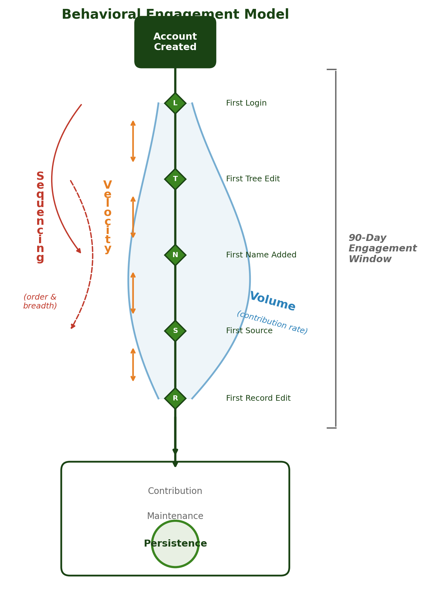
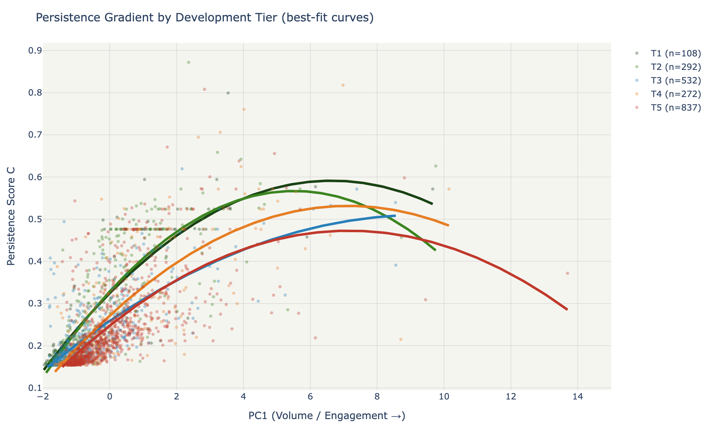
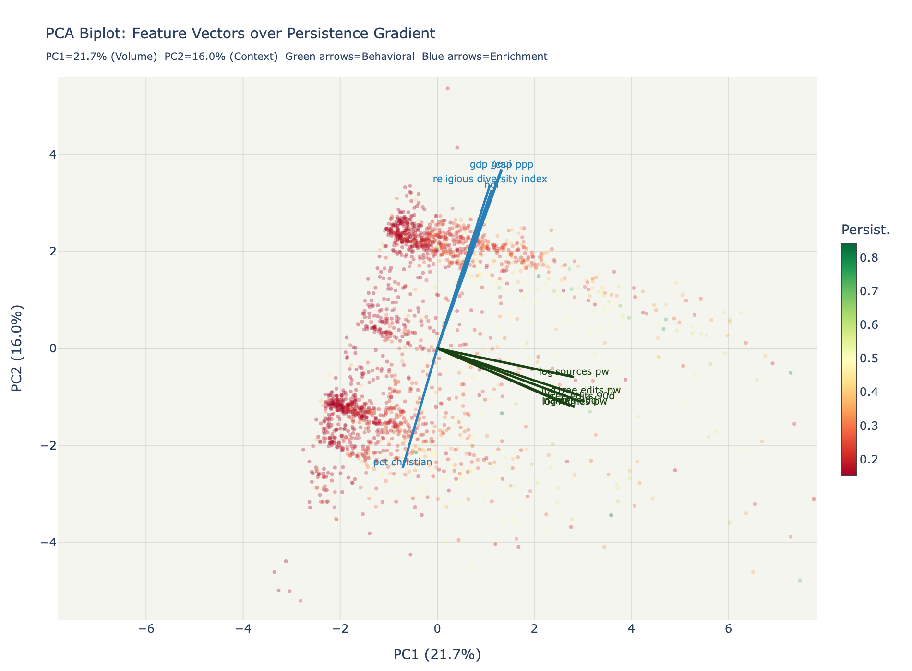

<p align="center">
  
  
  
  
  
  
</p>

# Ancestry Insights

**ML-driven user segmentation on 7.6 million genealogy records -- from raw behavioral data through tenure-normalized feature engineering, multi-algorithm clustering, and interactive exploration.**



---

## Behavioral Segmentation at Population Scale

The core challenge here is not clustering itself -- it is making clustering meaningful on data with structural pathologies that invalidate naive approaches. The raw dataset contains 7.6M user records where observation windows vary from 1 day to 365 days within the same table, 11 activity columns go null as a coordinated block (MNAR, not MAR), and heavy-tailed distributions span 4+ orders of magnitude.

The interesting engineering decisions happen before any model touches the data:

- **Tenure normalization** -- raw activity counts are meaningless when observation windows vary 365x. Every behavioral feature is rate-adjusted (per-week, per-90-day-window, log-transformed) to make a 30-day user comparable to a 300-day user.
- **MNAR block detection** -- 11 activity columns go null together. These are structurally missing (not randomly), so they cannot be imputed. They are detected, flagged, and excluded from the clustering population with explicit justification.
- **Composite index construction (GEPI)** -- no published index combines economic development, religiosity, and digital access for genealogy engagement prediction. The Genealogy Engagement Propensity Index was built from World Bank, UN HDI, and Pew Research data, then validated against observed registration rates across 201 countries.
- **Supervised-unsupervised fusion** -- discriminant analysis (LDA/RF) identifies which features predict persistence; unsupervised clustering (K-Means/GMM/HDBSCAN) discovers natural structure. The overlay reveals which behavioral clusters map onto actionable retention profiles.

> [!IMPORTANT]
> The central finding: behavioral engagement predicts user persistence with AUC 0.997. Demographic and socioeconomic context scores AUC 0.53 -- indistinguishable from chance. **How users engage matters; where they come from does not.** But context *moderates* the relationship: the Volume-to-Persistence curve shape changes systematically across development tiers.

---

## Key Findings

| Finding | Detail |
|---|---|
| One-and-done rate | 64% of accounts never return after first session |
| Age gradient | 1.76x login increase from age 20 to age 70 |
| Velocity suppression | Onboarding speed shows partial r = -0.53 with persistence after removing Volume collinearity -- a 2.7x amplification hidden by shared variance |
| Tier moderation | T1 (high-development) shows logarithmic saturation; T5 (lower-development) shows near-linear returns |
| Member vs. Public | LDS membership does not confound any finding -- identical feature rankings, identical tier gradients |



*Each tier exhibits a distinct Volume-to-Persistence curve shape. The gradient moves from logarithmic saturation (T1) through quadratic deceleration (T3-T4) to near-linear constant returns (T5).*

---

## Architecture

The analysis pipeline is organized as a 7-layer DuckDB database where each layer is reproducible from the one above it. No pandas-in-memory recomputation on restart.

```
Raw CSV (7.6M rows, 33 cols)
  --> Layer 1: Immutable raw ingest
    --> Layer 2: Deterministic cleaning (nulls, clipping, tenure calc)
      --> Layer 3: 25+ engineered features (Velocity / Volume / Sequencing / Persistence)
        --> Layer 4: External enrichment (World Bank, UN HDI, Pew religiosity, GEPI)
          --> Layer 5: Stratified subsampling (T=10 x 5,000, Cochran floor guarantees)
            --> Layer 6: Clustering experiments (K-Means, GMM, HDBSCAN grid search)
              --> Layer 7: Final assignments, profiles, publication figures
```

| Pipeline Phase | Script | Purpose |
|---|---|---|
| Infrastructure | `phase1_infrastructure.py` | CSV ingest, QC, DuckDB schema creation |
| Features | `phase2_features.py` | 4-construct feature engineering (25+ variables) |
| Enrichment | `phase3_enrichment.py` | World Bank WDI, UN HDI, country crosswalk |
| Religiosity | `phase3_pew_integration.py` | Pew Research religious composition (201 countries) |
| Subsampling | `phase4_subsampling.py` | Stratified bootstrap draws with recorded weights |
| Classification | `phase5_classification.py` | LDA / Random Forest discriminant analysis |
| Clustering | `phase6_clustering.py` | K-Means, GMM across feature set configurations |
| Optimization | `phase7_cluster_optimization.py` | Rotation / weighting grid search |
| Deep Dive | `phase7b_deep_dive.py` | Bootstrap stability, biplots, radar profiles |
| Final | `final_analysis.py` | Factorial design: 3 populations x 3 blocks x 5 tiers |

---

## PCA Biplot: Two Independent Subspaces



The biplot captures the geometric structure of the entire analysis. Green arrows (behavioral features) point rightward along PC1, tracking the persistence gradient. Blue arrows (enrichment features: GDP, HDI, GEPI) point upward along PC2, defining the development-tier bands. The two dimensions are orthogonal -- behavior and context occupy independent subspaces.

---

## Interactive Dashboard

An 8-page Streamlit application provides interactive exploration across the full analysis lifecycle:

| Page | Function |
|---|---|
| Workflow | Pipeline architecture and phase dependencies |
| Data Quality | MNAR detection, distribution audits, null-block analysis |
| EDA | Tenure distributions, activity correlations, geographic patterns |
| Feature Lab | Construct explorer with importance rankings and collinearity |
| Clustering Lab | Live algorithm comparison (K-Means / GMM / HDBSCAN), silhouette plots |
| Segment Profiles | Radar charts, tier heatmaps, persistence distributions |
| Insights | Actionable findings with supporting evidence |
| About | Methodology notes and data provenance |

---

<details>
<summary><strong>Getting Started</strong></summary>

### Prerequisites

- Python 3.12+
- ~2GB disk for DuckDB database (generated from raw data)

### Installation

```bash
git clone https://github.com/your-username/ancestry-insights.git
cd ancestry-insights
python -m venv .venv && source .venv/bin/activate
pip install -r requirements.txt
```

### Running the Pipeline

Phases are sequential -- each reads from the DuckDB layers created by previous phases:

```bash
python src/phase1_infrastructure.py    # Requires data/raw/users.csv
python src/phase2_features.py
python src/phase3_enrichment.py
python src/phase3_pew_integration.py
python src/phase4_subsampling.py
python src/phase5_classification.py
python src/phase6_clustering.py
python src/phase7_cluster_optimization.py
python src/phase7b_deep_dive.py
python src/final_analysis.py
```

### Launching the Dashboard

```bash
./run_dashboard.sh
# Open http://localhost:8501
```

> [!NOTE]
> The raw dataset (7.6M records) is not included in this repository due to data licensing. All pipeline code, dashboard source, methodology documentation, and generated outputs (147 figures, 26 reports) are fully available for review.

</details>

<details>
<summary><strong>Tech Stack</strong></summary>

| Layer | Tools |
|---|---|
| Data Storage | DuckDB (embedded columnar OLAP), Parquet exports |
| Processing | pandas, NumPy, PyArrow |
| ML | scikit-learn (K-Means, GMM, LDA, RF, PCA), hdbscan, umap-learn |
| Statistics | SciPy (chi-squared, partial correlation, curve fitting), bootstrap validation |
| Visualization | Plotly (interactive), Matplotlib, Seaborn |
| Dashboard | Streamlit (multi-page, custom theming) |
| External Data | World Bank API (wbgapi), Pew Research (pyreadstat/SPSS), UN HDI |
| Reporting | python-pptx (automated executive slide deck) |

</details>

<details>
<summary><strong>Repository Structure</strong></summary>

```
ancestry-insights/
  src/                          # Analysis pipeline (22 modules, ~7K LOC)
    phase1_infrastructure.py    # CSV ingest, QC, DuckDB schema
    phase2_features.py          # 4-construct feature engineering
    phase3_enrichment.py        # World Bank + UN enrichment
    phase3_pew_integration.py   # Pew religiosity integration
    phase4_subsampling.py       # Stratified bootstrap draws
    phase5_classification.py    # LDA / RF discriminant analysis
    phase6_clustering.py        # K-Means, GMM clustering
    phase7_cluster_optimization.py  # Rotation + weighting grid search
    phase7b_deep_dive.py        # Publication-quality profiling
    final_analysis.py           # End-to-end factorial design
    build_slide_deck.py         # Automated PowerPoint generation
    features/                   # Feature engineering utilities
    models/                     # Clustering model wrappers
  dashboard_v2/                 # Streamlit app (8 pages, ~2K LOC)
    Home.py
    pages/                      # Workflow, Data Quality, EDA, Feature Lab,
                                # Clustering Lab, Segment Profiles, Insights, About
    components/                 # Branding, charts, metrics
  docs/                         # Methodology, literature review, hypothesis pipeline
  outputs/                      # 147 figures, 26 reports across 18 subdirectories
```

</details>

---

## License

MIT License. See [LICENSE](LICENSE) for details.

---

<p align="center">
  <i>7.6 million behavioral records, 25 engineered features, 5 development tiers -- segmentation built on statistical rigor, not assumptions.</i>
</p>