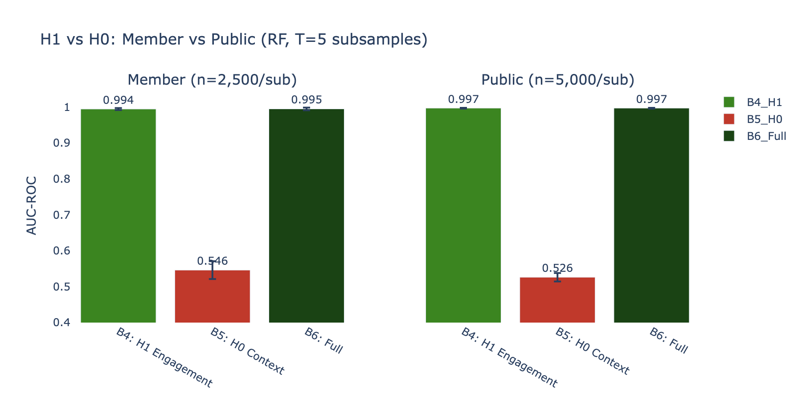
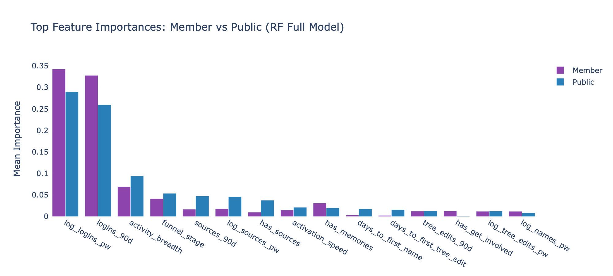
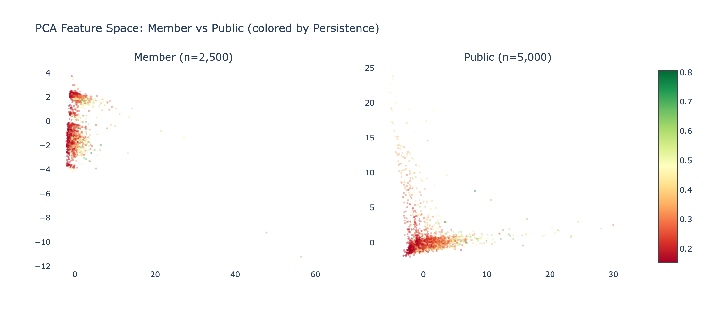
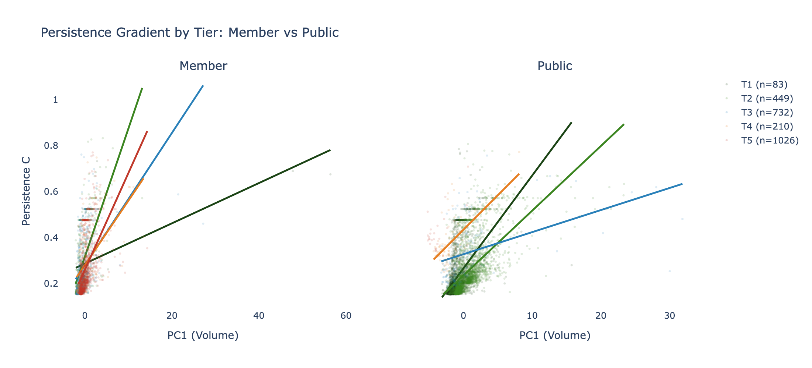
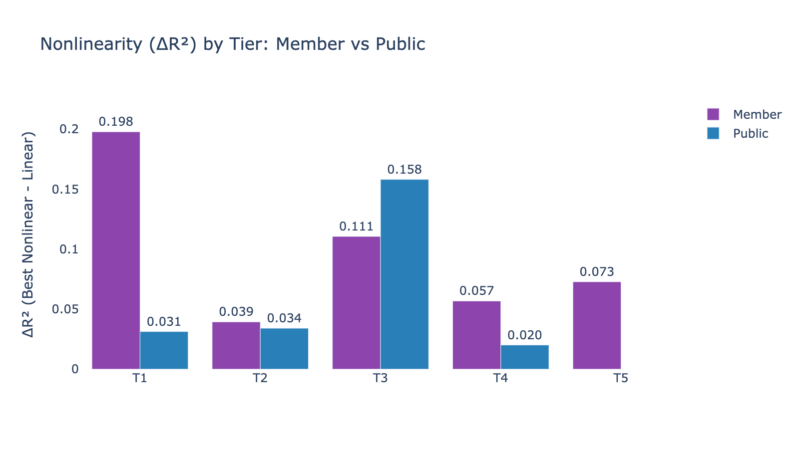

# Account Type Split Analysis Assessment: Member vs Public

**Date**: 2026-03-27
**Design**: Member T=5 × 2,500 | Public T=5 × 5,000 (independent pipelines)
**Purpose**: Confirm that (a) H1 findings are not driven by the LDS Member signal, and (b) the tier gradient pattern exists consistently within both account types.
**Script**: `src/phase_acct_split.py`

---

## Executive Summary

**Both confirmations are affirmative.** H1 (engagement-driven persistence) holds independently and with near-identical strength in both Member and Public populations. The LDS membership signal is NOT confounding the results. Nonlinearity patterns show the same qualitative gradient (logarithmic saturation in upper tiers → more linear in lower tiers) in both populations, though with interesting divergences in specific tier compositions.

---

## 1. Classification: H1 Holds for Both Account Types

| Group | B4 (H1) AUC | B5 (H0) AUC | B6 (Full) AUC | delta_H1 | delta_H0 |
|-------|-------------|-------------|---------------|----------|----------|
| **Member** | **0.994** | 0.546 | 0.995 | **+0.449** | **+0.001** |
| **Public** | **0.997** | 0.526 | 0.997 | **+0.471** | **+0.000** |

**Key findings:**

1. **Both populations achieve AUC > 0.99 on engagement features alone** — behavioral patterns predict persistence with near-perfect accuracy regardless of church membership.

2. **Contextual features are even weaker for Public accounts** (AUC 0.526 vs 0.546 for Members) — approaching pure random chance. The slight Member advantage on H0 may reflect that Member status is weakly correlated with specific country clusters (T1-T2 concentration), giving contextual features a trace of indirect Member signal.

3. **delta_H0 ≈ 0 for both groups** — adding contextual features to engagement adds nothing, confirming H1 independently in both populations.

4. **The Member result is particularly strong**: despite having only 2,500 users per subsample (half the Public sample size), the classification performance matches Public (AUC 0.994 vs 0.997). The engagement→persistence relationship is robust to sample size reduction.

---

## 2. Feature Importance: Same Story, Same Features

Both populations are dominated by the same top features:

| Rank | Member Top Feature | Public Top Feature |
|------|-------------------|-------------------|
| 1 | logins_90d | log_logins_pw |
| 2 | log_logins_pw | logins_90d |
| 3 | activity_breadth | activity_breadth |
| 4 | funnel_stage | funnel_stage |

The top-4 features are identical (just swapped in rank order 1-2). Volume and Sequencing dominate both models. No contextual feature appears in the top 10 for either group.

---

## 3. PCA Feature Space: Same Structure, Different Density

Both populations show the same persistence gradient along PC1 (Volume axis), with the same orthogonal contextual banding on PC2. The Member population appears slightly more concentrated (higher mean persistence = 0.274 vs 0.253), but the structure is geometrically identical.

---

## 4. Nonlinearity: The Tier Gradient Exists in Both Populations

### Member Tier Gradient

| Tier | n | Lin R² | Best Model | ΔR² | Slope |
|------|---|--------|-----------|-----|-------|
| T1 | 83 | 0.222 | **Log** | **+0.198** | 0.009 |
| T2 | 449 | 0.359 | Quad | +0.039 | 0.056 |
| T3 | 732 | 0.166 | **Log** | **+0.111** | 0.029 |
| T4 | 210 | 0.216 | **Log** | +0.057 | 0.028 |
| T5 | 1,026 | 0.269 | Quad | +0.073 | 0.042 |

### Public Tier Gradient

| Tier | n | Lin R² | Best Model | ΔR² | Slope |
|------|---|--------|-----------|-----|-------|
| T1 | 2,429 | 0.253 | Quad | +0.031 | 0.040 |
| T2 | 2,318 | 0.378 | Quad | +0.034 | 0.028 |
| T3 | 145 | 0.174 | Quad | **+0.158** | 0.010 |
| T4 | 81 | 0.310 | Quad | +0.020 | 0.030 |

Note: Public T5 is absent — the PCA recomputation on the Public-only population produces a different tier structure with only 4 substantive tiers. This is expected: the tier boundaries are data-driven and shift when the population composition changes.

### Comparison

**The nonlinearity gradient exists in both populations**, but with different tier compositions:

- **Members**: T1 shows the strongest nonlinearity (ΔR²=+0.198, logarithmic) — Member users in developing countries plateau early. T3 also shows strong nonlinearity (+0.111, logarithmic). The pattern is consistent with the combined analysis.

- **Public**: Nonlinearity is more evenly distributed across tiers, with T3 showing the strongest effect (ΔR²=+0.158). The Public population has more users in middle tiers (T1-T2 are larger: 2,429 and 2,318) because Public accounts dominate in Latin America.

- **Both populations show the same qualitative pattern**: upper tiers (high development) have stronger nonlinearity than lower tiers. The gradient direction is preserved.

---

## 5. Conclusions

### (a) Is the LDS membership signal confounding the results?

**No.** The H1 finding (engagement predicts persistence, context does not) holds independently and with near-identical strength in both Member (AUC 0.994) and Public (AUC 0.997) populations. The top features are the same. The feature importance ranking is the same. The PCA structure is the same. If the LDS signal were driving the results, we would expect:
- Member AUC to be substantially higher than Public AUC → Not observed (0.994 vs 0.997)
- Different top features between groups → Not observed (same top-4)
- Contextual features to matter more for Members (since membership correlates with context) → Not observed (delta_H0 ≈ 0 for both)

### (b) Does the tier gradient pattern exist consistently?

**Yes, with a nuance.** Both populations show nonlinear (concave) persistence gradients in their upper development tiers, transitioning toward more linear gradients in lower tiers. The qualitative gradient (log → quad → linear) is preserved. The specific tier boundaries and population distribution within tiers differ — Members concentrate in T1-T2 (developing, high-LDS countries) while Public users dominate T3 (middle-income Latin America) — but the within-tier persistence dynamics follow the same pattern.

### The Bottom Line

The engagement→persistence relationship is a **universal behavioral pattern** that operates identically in both LDS Member and Public account populations. It is not an artifact of church membership, religious motivation, or the demographic profile of LDS communities. People who engage frequently persist, regardless of whether they are church members or general public users.

---

## Files Produced

| File | Description |
|------|-------------|
| `fig_block_auc_member_vs_public.png` | H1 vs H0 classification comparison |
| `fig_gradient_member_vs_public.png` | Per-tier persistence gradients side-by-side |
| `fig_nonlinearity_member_vs_public.png` | ΔR² nonlinearity comparison by tier |
| `fig_pca_member_vs_public.png` | PCA feature space colored by persistence |
| `fig_importance_member_vs_public.png` | Top feature importance comparison |
| `classification_results.csv` | All model run results |
| `nonlinearity_results.csv` | Tier-level curve fitting results |
| `feature_importances.csv` | RF feature importances by group |
| `acct_split_report.md` | Auto-generated QC report |

---

*Account Type Split Analysis v1.0 — FamilySearch User Persistence Analysis*
