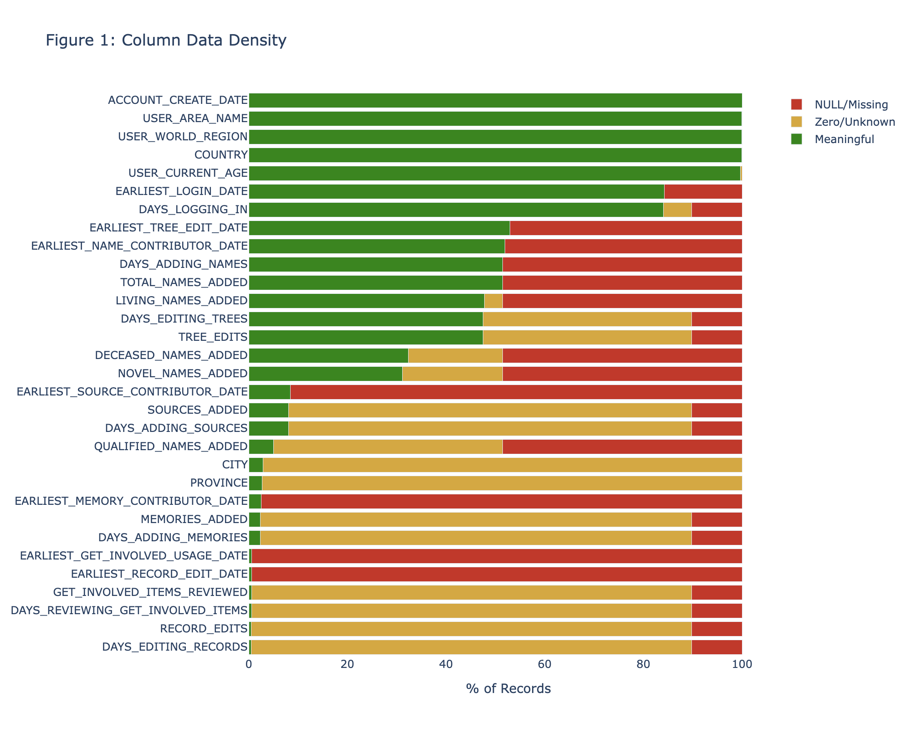
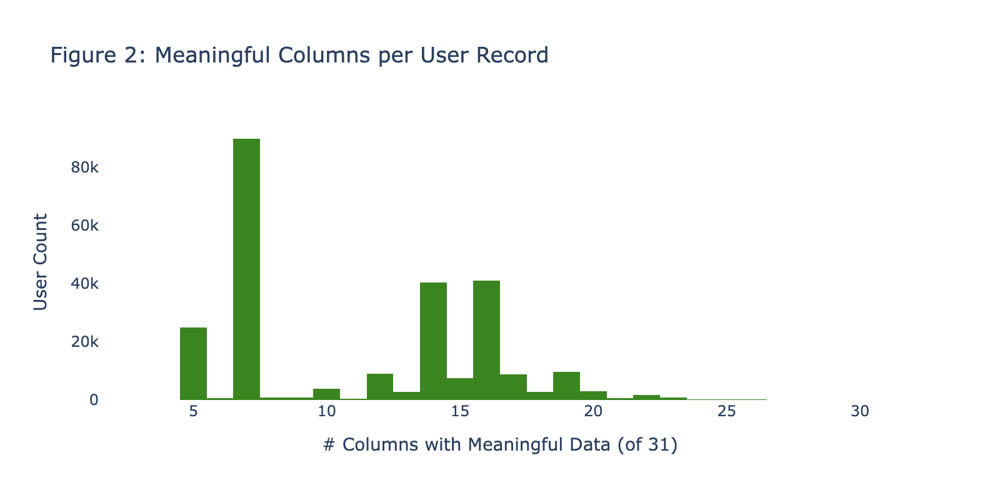
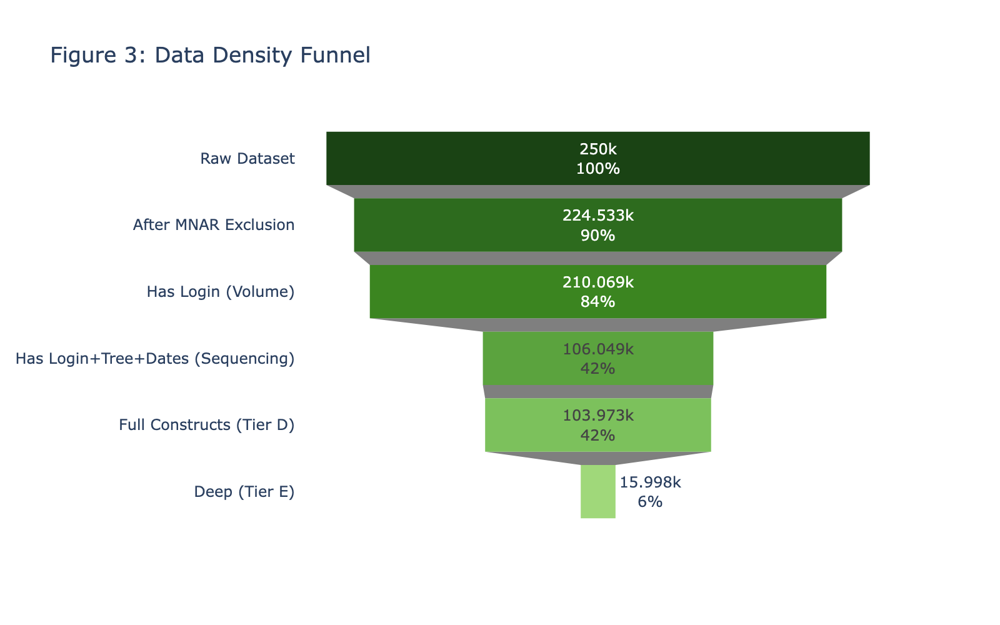
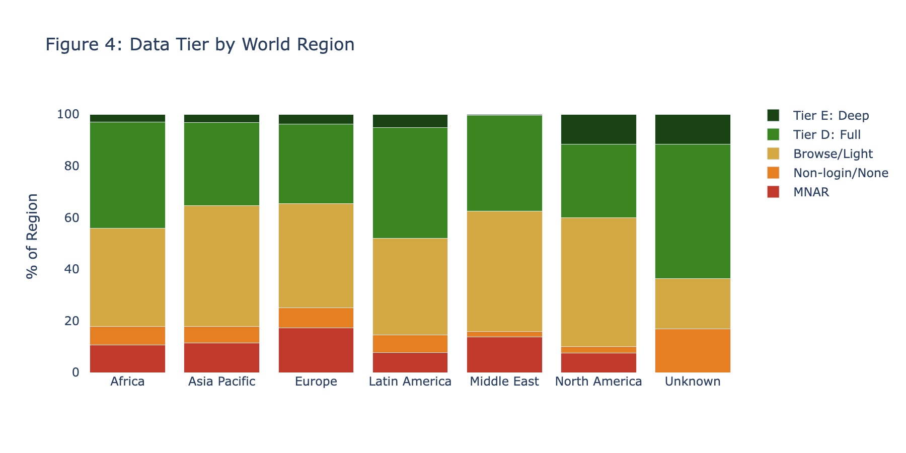
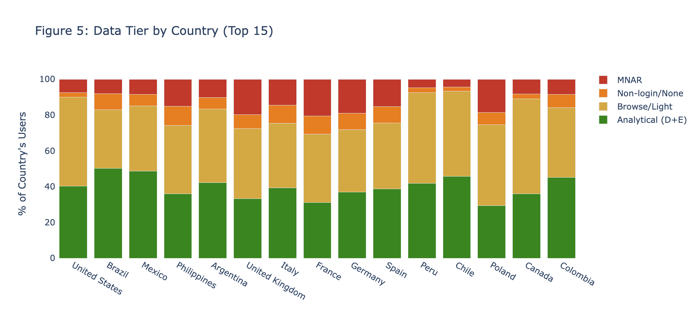
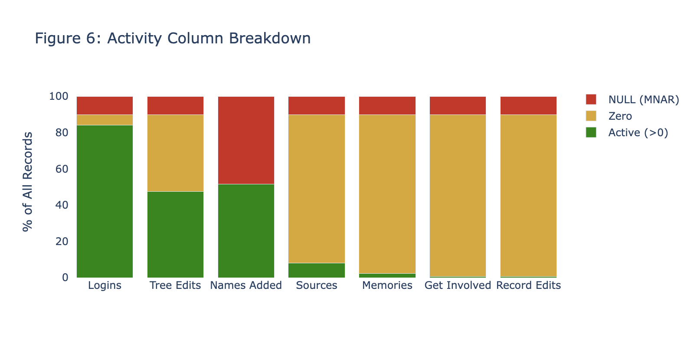

# Data Density Assessment: Missingness, Zeroness, and Analytical Yield

**Date**: 2026-03-26
**Dataset**: FamilySearch User Segmentation (250K stratified sample of 7.6M)
**Purpose**: Comprehensive assessment of data sparsity to determine what subset of the dataset is viable for classification, clustering, and hypothesis-driven segmentation analysis.

---

## Executive Summary

The FamilySearch dataset of 7.6M user records is dominated by sparse, zero-value, and missing data. After systematic assessment of all 31 analytical columns (excluding USER_ID and ACCOUNT_TYPE):

- **10.2%** of records are untracked by the data pipeline (MNAR block — all 11 activity columns NULL)
- **41.6%** of records survive all filters to constitute the **analytical population** (Tier D: users with login + tree edits + names + associated milestone dates)
- **6.4%** qualify as **deep records** (Tier E: Tier D + source contributions)
- **36.8%** logged in but never contributed anything (browse-only) — they have one meaningful data point
- **5.7%** contributed without ever logging in (non-login contributors — likely API/batch users)

The remaining ~42% analytical yield is sufficient for proof-of-concept classification and clustering, but the Velocity and Sequencing constructs are constrained to 3 milestone types (login, tree edit, name add). Rarer activities (sources, memories, get involved, record edits) are performed by fewer than 10% of users and cannot anchor temporal analysis.

**Geographic bias**: Europe contributes disproportionate MNAR (17.3% of European users are untracked vs 7.6% for Latin America). Latin America has the highest analytical yield (48.0% at Tier D+E). North America has the highest browse-only rate (43.6%).

---

## Figure 1: Column Data Density

**What this shows**: For each of the 31 analytical columns, the proportion of records that are meaningful (green), zero/unknown/sentinel (yellow), or NULL/missing (red).

**Key observations**:
- Only 7 columns have >50% meaningful data: ACCOUNT_CREATE_DATE, USER_CURRENT_AGE, COUNTRY, USER_WORLD_REGION, USER_AREA_NAME, EARLIEST_LOGIN_DATE, and DAYS_LOGGING_IN
- TREE_EDITS and name columns hover around 48-52% meaningful
- Sources, memories, get involved, and record edits are **0.6-8% meaningful** — the yellow (zero) band dominates
- Province and City are 97%+ unknown (yellow)
- The 11 activity count columns all share the same 10.2% NULL band (MNAR block)

---

## Figure 2: Meaningful Columns per User Record

**What this shows**: Distribution of how many of the 31 columns have meaningful (non-null, non-zero, non-sentinel) data per user record.

**Key observations**:
- The distribution is **trimodal**:
  - Peak at 5 columns (10%): MNAR block users — only demographics are populated
  - Peak at 7 columns (36%): Browse-only users — demographics + login count + login date
  - Peak at 14-16 columns (16-16%): Active contributors — demographics + login + tree edits + names + associated dates
- The median user has **10 meaningful columns** out of 31 (32%)
- Only 6.6% of users have 17+ meaningful columns (with source data)
- Only 0.2% have 25+ meaningful columns (deep multi-activity users)

---

## Figure 3: Data Density Funnel

**What this shows**: Progressive attrition as increasingly strict data requirements are applied.

**Critical drops**:
- Raw → MNAR exclusion: -10.2% (pipeline artifact, no behavioral data)
- MNAR-excluded → Has login: -5.8% (non-login contributors, analyzed separately)
- Has login → Has login + tree edits + dates: **-49.4%** (the browse-only population drops out)
- Tree edits → Full constructs (Tier D): only -0.8% (nearly all tree-editors also add names)
- Tier D → Tier E (deep): **-87% of Tier D** — sources are rare

**Bottom line**: The biggest single attrition is the browse-only population (42% of the dataset), who logged in but never made a single contribution.

---

## Figure 4: Data Tier Distribution by World Region

**What this shows**: For each world region, the proportion of users in each data tier.

**Geographic patterns in MNAR**:
- **Europe has 2.3x the MNAR rate of Latin America** (17.3% vs 7.6%)
- Europe contributes 37.8% of all MNAR block records despite being only 22.3% of the dataset
- This suggests the data pipeline capture issue disproportionately affected European users — possibly a deployment timing or regional infrastructure difference

**Geographic patterns in analytical yield**:
| Region | Analytical (D+E) | Browse-only | MNAR |
|--------|------------------|-------------|------|
| Latin America | **48.0%** | 31.3% | 7.6% |
| Africa | **44.2%** | 32.8% | 10.6% |
| North America | 40.0% | **43.6%** | 7.5% |
| Middle East | 37.6% | 41.6% | 13.7% |
| Asia Pacific | 35.4% | 42.2% | 11.4% |
| Europe | **34.6%** | 35.8% | **17.3%** |

Latin America and Africa have the highest analytical yield; Europe has the lowest (penalized by high MNAR). North America has the highest browse-only rate — many US users create an account, log in once, and leave.

---

## Figure 5: Data Tier Distribution — Top 15 Countries

**What this shows**: Country-level breakdown for the 15 largest user populations.

**Highest analytical yield**: Brazil (50.2%), Mexico (48.7%), Chile (45.7%), Colombia (45.1%)
**Lowest analytical yield**: Poland (29.3%), France (31.2%), UK (33.3%), Philippines (35.9%)
**Highest MNAR**: France (20.5%), UK (19.7%), Germany (19.1%), Poland (18.6%)
**Highest browse-only**: Canada (51.6%), Peru (50.2%), US (47.9%), Chile (46.8%)

**Pattern**: European countries have high MNAR + moderate browse-only = low analytical yield. Latin American countries have low MNAR + moderate browse-only = high analytical yield. Anglophone countries (US, Canada, UK) have high browse-only rates.

---

## Figure 6: Activity Column Breakdown

**What this shows**: For each of the 7 activity types, the proportion of users who are active (>0), zero, or NULL.

**The sparsity hierarchy**:
| Activity | Active (>0) | Zero | NULL |
|----------|------------|------|------|
| Logins | **84.0%** | 5.8% | 10.2% |
| Tree Edits | **47.5%** | 42.3% | 10.2% |
| Names Added | **51.5%** | 38.3% | 10.2% |
| Sources Added | 8.1% | **81.7%** | 10.2% |
| Memories Added | 2.3% | **87.5%** | 10.2% |
| Get Involved | 0.6% | **89.2%** | 10.2% |
| Record Edits | 0.6% | **89.2%** | 10.2% |

**The 10.2% NULL band is constant** across all 11 activity columns — confirming the MNAR block is a single pipeline failure affecting the same users.

**Three usable activities**: Only logins (84%), tree edits (47.5%), and names (51.5%) have sufficient non-zero prevalence for rate-based features. Sources (8.1%) are marginally usable. Memories, get involved, and record edits (<3%) are too sparse for per-user rate computation.

---

## Are Missing and Zero the Same?

**For modeling purposes, they converge toward the same analytical impact**, but they have different origins:

| Status | Origin | Analytical Impact | Action |
|--------|--------|------------------|--------|
| **NULL (MNAR block)** | Pipeline never captured this user | No behavioral signal at all | **Exclude** — not imputable |
| **Zero (tracked, no activity)** | User exists in pipeline but never performed this activity | Valid behavioral signal: "user chose not to do X" | **Retain as 0** — informative zero |
| **Zero (effectively all columns)** | 63 users tracked with all-zero activity | Functionally identical to MNAR but pipeline DID see them | **Exclude** — no discriminative signal |

The distinction matters for *why* data is sparse but not for *what you can model*. A user with SOURCES_ADDED=NULL and a user with SOURCES_ADDED=0 both contribute zero information on the source-contribution dimension. The only users where the NULL/zero distinction matters are the **non-login contributors** (5.7%), who have DAYS_LOGGING_IN=0 but TREE_EDITS>0 — they contributed through non-web-session channels.

**Bottom line**: After excluding the MNAR block, the zeros in sparse activity columns are genuine behavioral signal (non-participation), but they are analytically equivalent to "feature not available for this user" when building rate-based features. You cannot compute a meaningful SOURCES_PER_WEEK rate for a user who has added zero sources — the rate is 0.0, which is technically correct but carries no discriminative power for clustering or classification.

---

## The Analytical Population: What's Left

**Tier D (Full Constructs)** — 103,973 users (41.6% of sample, ~3.2M at population scale):
- Has: login count + tree edits + names + login date + tree edit date + name date
- Can compute: Volume (login rate, tree edit rate, name rate), Velocity (3 milestone gaps), Sequencing (3-step ordered sequence), Persistence (all three definitions)
- Cannot compute: source/memory/get-involved/record-edit rates (zero for >90%)

**Tier E (Deep)** — 15,998 users (6.4%, ~490K at population scale):
- Has: everything in Tier D + source contributions + source date
- Can compute: All constructs including 4-step sequencing
- Represents the "power user" tail — may not generalize

**Recommended analytical population**: **Tier D** (42%). Tier E is available for sensitivity analysis but should not be the primary population (too small, too biased toward power users).

---

## Implications for the Hypothesis Pipeline

1. **Sequencing is a 3-step construct** for 42% of users, a 4-step construct for 6%. The hypothesis pipeline must scope Sequencing accordingly.
2. **Volume is dominated by 3 activities**: logins, tree edits, names. The other 4 activities are too sparse for individual rate features but can contribute to the binary activity breadth count.
3. **The browse-only population (37%) has one data point** (they logged in). They cannot be classified or clustered on behavioral features — they are Segment 0.
4. **Geographic representativeness is uneven**: Europe is underrepresented in the analytical population (34.6% yield vs 48.0% for Latin America). Subsampling should stratify by region to avoid Latin American dominance.
5. **The proof-of-concept is viable at ~42% yield** from 7.6M = ~3.2M users. For T=10 x 5K subsamples, we draw from this pool, ensuring adequate coverage of all country clusters and demographic groups.

---

*Data Density Assessment v1.0 — FamilySearch User Persistence Analysis*
*2026-03-26*
