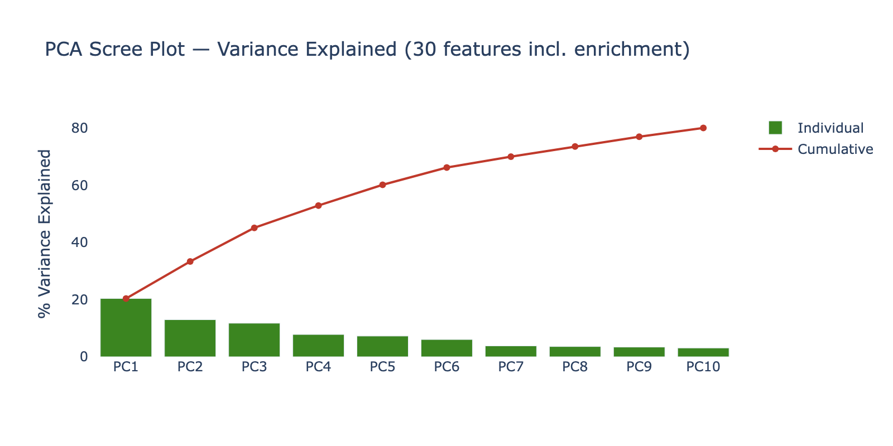
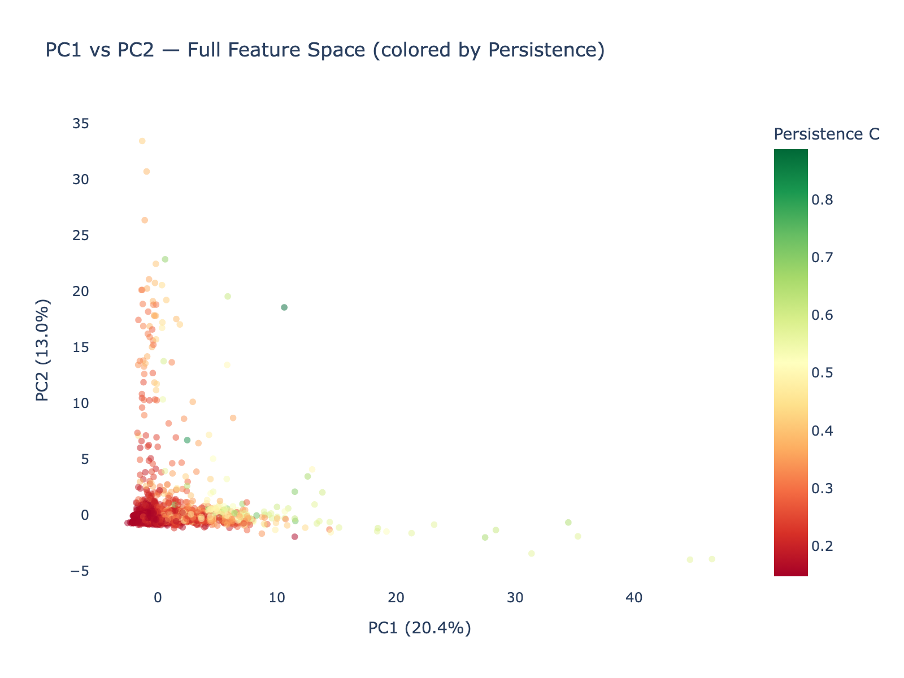
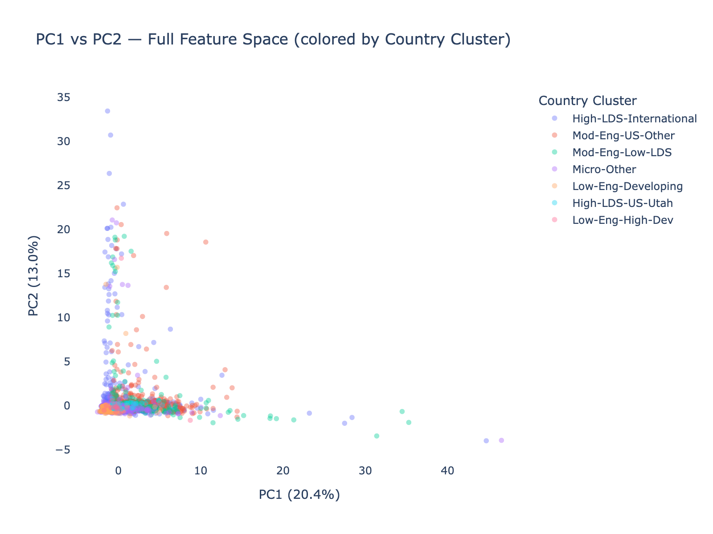
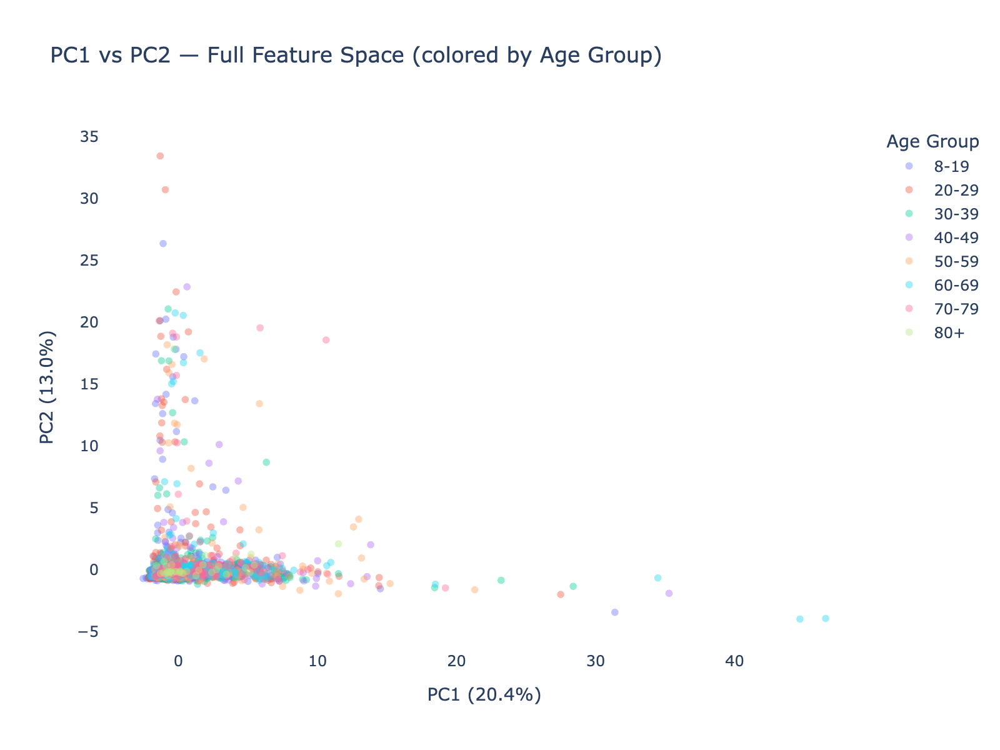
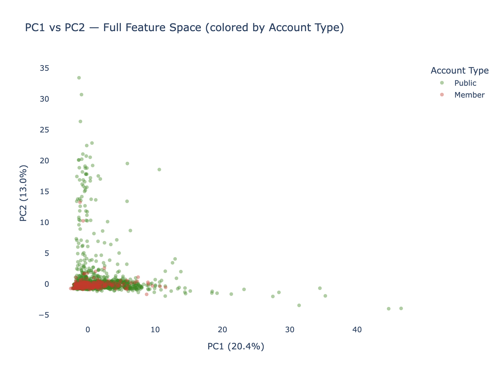
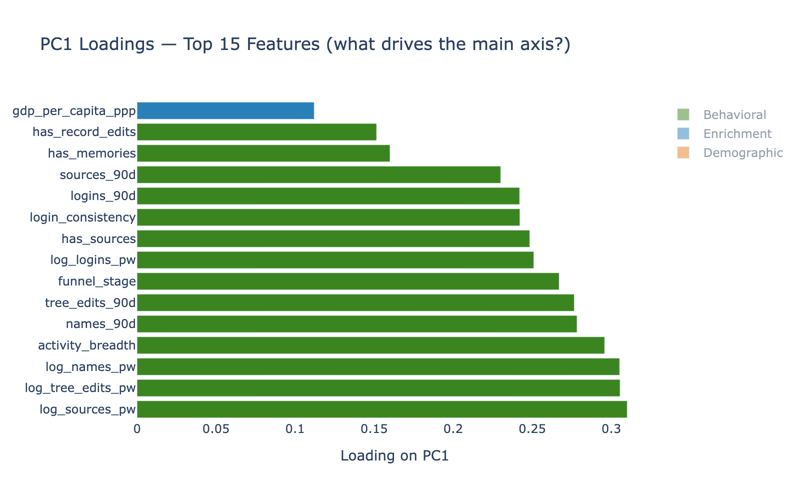
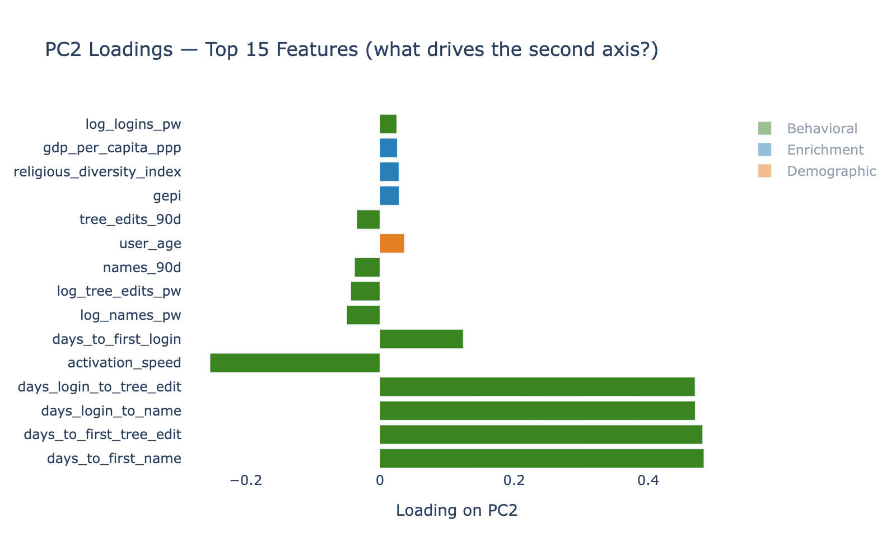
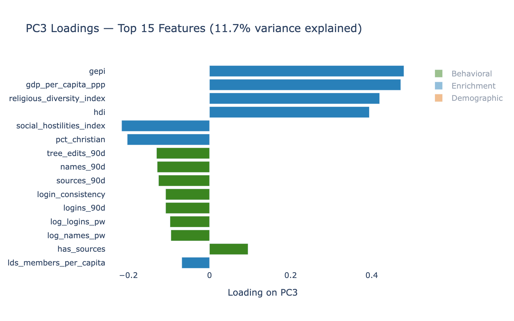
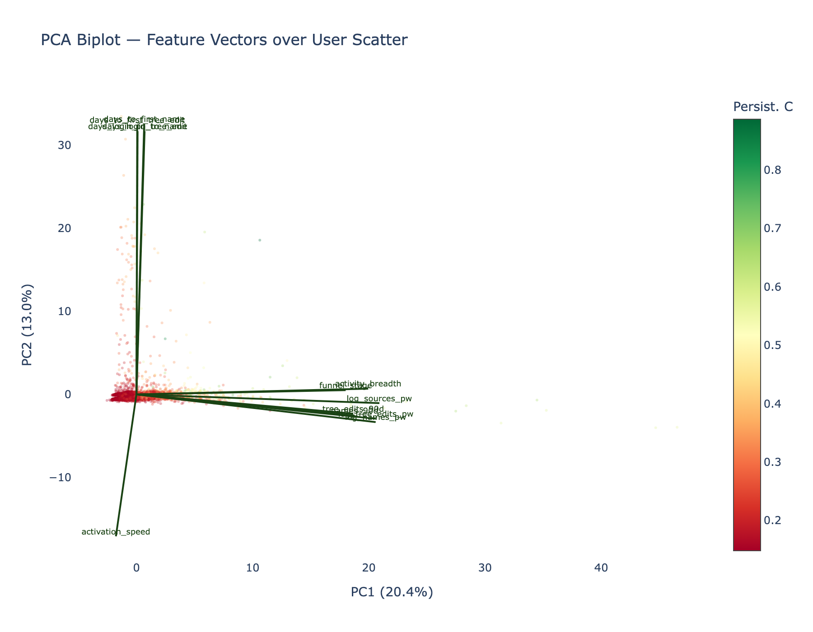

# Exploratory PCA Assessment: Full Feature Space Topography (All Tier D)

**Date**: 2026-03-26
**Population**: Tier D subsample 01 (5,079 users, all Tier D)
**Features**: 30 (21 behavioral + 8 enrichment + 1 demographic)
**Output**: 10 figures (7 PNG + 3 interactive HTML) + loadings table

---

## Executive Summary

PCA on the full 30-feature space (behavioral engagement + country-level enrichment + age) reveals a clean three-axis structure: **PC1 (20.4%) = Volume/Engagement**, **PC2 (13.0%) = Velocity/Onboarding**, **PC3 (11.7%) = Contextual/Development**. These three axes are nearly orthogonal — behavioral engagement and country context occupy different dimensions of the data, explaining why contextual features add nothing to Persistence prediction (Phase 5). Ten components capture 80% of total variance.

---

## Variance Structure

| PC | Variance | Cumulative | Dominant Construct |
|----|---------|-----------|-------------------|
| PC1 | 20.4% | 20.4% | **Volume** (log_sources_pw, log_tree_edits_pw, log_names_pw) |
| PC2 | 13.0% | 33.4% | **Velocity** (days_to_first_name, days_to_first_tree_edit) |
| PC3 | 11.7% | 45.1% | **Contextual** (gepi, gdp_per_capita_ppp, religious_diversity_index) |
| PC4 | 7.8% | 52.9% | Mixed |
| PC5 | 7.2% | 60.2% | Mixed |
| PC6-10 | 3.1-6.0% each | 80.1% | Residual |

**Key insight**: The top 3 PCs each align cleanly with one of the three analytical constructs. This is not guaranteed — it reflects genuine separability in the data. Engagement patterns, onboarding speed, and country development are largely independent dimensions of user variation.

---

## PCA Projections

### PC1 × PC2 — Colored by Persistence

The persistence gradient runs clearly left-to-right along PC1 (Volume axis). High PC1 = high Volume = green (persistent). The gradient is nearly independent of PC2 position — confirming that onboarding speed (Velocity) is a weak predictor of long-term Persistence.

### PC1 × PC2 — Colored by Country Cluster

Country clusters overlap extensively in the PC1-PC2 plane — no geographic separation is visible. Users from "High-LDS International" and "Mod-Eng Low-LDS" occupy the same feature space. This is the visual proof that country context does not partition behavioral engagement.

### PC1 × PC2 — Colored by Age Group

Age groups also overlap extensively. No age-based stratification is visible in the behavioral feature space. The 8-19 cohort (yellow) is slightly concentrated in the low-Volume region but not exclusively.

### PC1 × PC2 — Colored by Account Type

Member accounts (red) skew slightly toward higher PC1 (more Volume), consistent with the known 3x engagement differential. But the overlap is substantial — many Public accounts occupy the same high-engagement space as Members.

---

## Feature Loadings

### PC1 — The Volume Axis

All top 10 loadings are **Behavioral** (green): contribution rates, activity breadth, funnel stage. No enrichment or demographic feature loads meaningfully on PC1. This axis IS the engagement dimension.

### PC2 — The Velocity Axis

Dominated by milestone timing features: `days_to_first_name` (0.48), `days_to_first_tree_edit` (0.48), `days_login_to_name` (0.47). Negative `activation_speed` (-0.25) confirms direction: high PC2 = slow starters.

### PC3 — The Contextual Axis

Dominated by **Enrichment** (blue): `gepi` (0.48), `gdp_per_capita_ppp` (0.47), `religious_diversity_index` (0.42), `hdi` (0.39). Zero behavioral features in the top 5. This axis captures "what kind of country are you from?" — completely orthogonal to PC1 (engagement).

---

## Biplot

The biplot overlays feature loading vectors on the user scatter. Volume arrows (logins, tree edits, sources) point right toward high Persistence (green points). Velocity arrows (days_to_first_*) point upward, orthogonal to the persistence gradient. Enrichment arrows (GDP, HDI) point into the page (PC3 direction) — a completely different dimension.

---

## 3D Visualizations

Interactive HTML files are available for browser-based rotation and exploration:

- **fig_pca_3d_persistence.html** — 3D PC1×PC2×PC3 colored by Persistence score
- **fig_pca_3d_country.html** — Same, colored by country cluster
- **fig_pca_3d_area.html** — Same, colored by USER_AREA_NAME (26 areas)

In the 3D view, the contextual axis (PC3) adds vertical stratification — users from high-GDP/high-HDI countries sit higher on PC3 — but this stratification is independent of the PC1 persistence gradient. The "layers" the user observed in the 2D projection are the PC3 contextual bands projected onto PC2.

---

## Loadings Table

Full loadings for all 30 features saved to `pca_loadings_table.csv`.

---

*Exploratory PCA Assessment v1.0 — FamilySearch User Persistence Analysis (All Tier D)*
