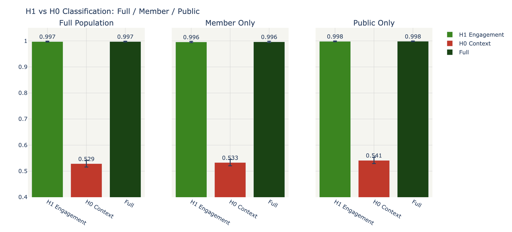
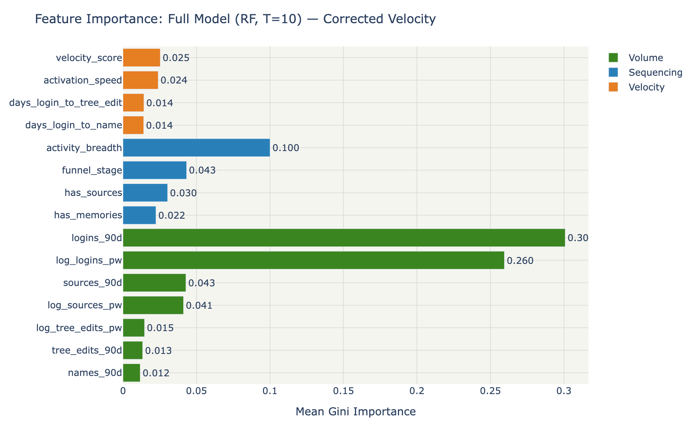
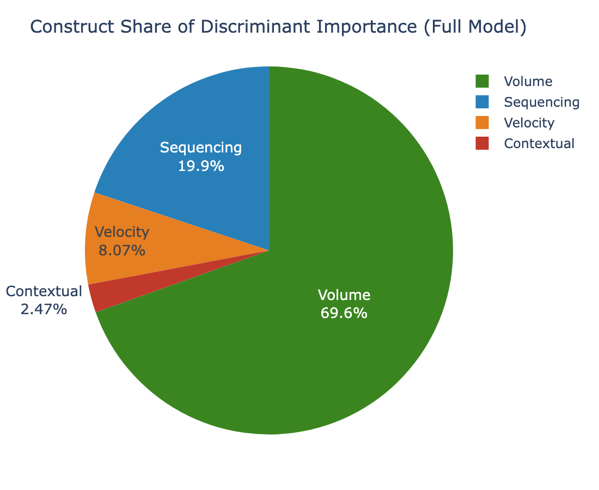
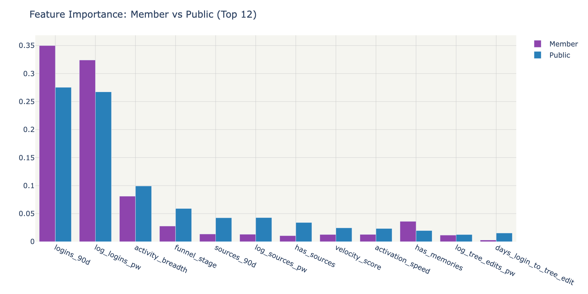
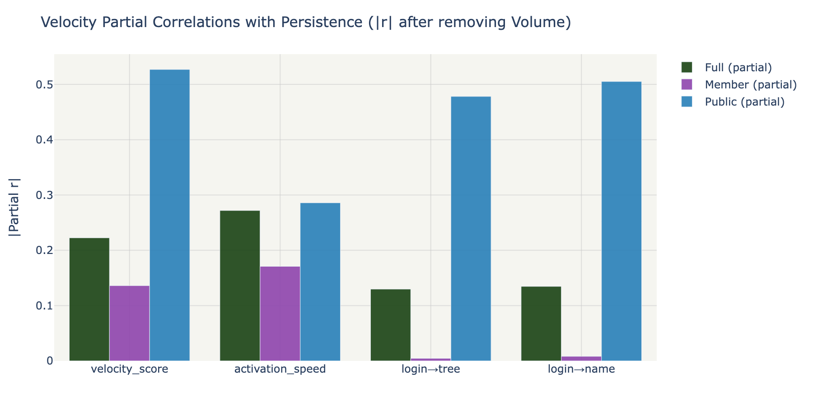
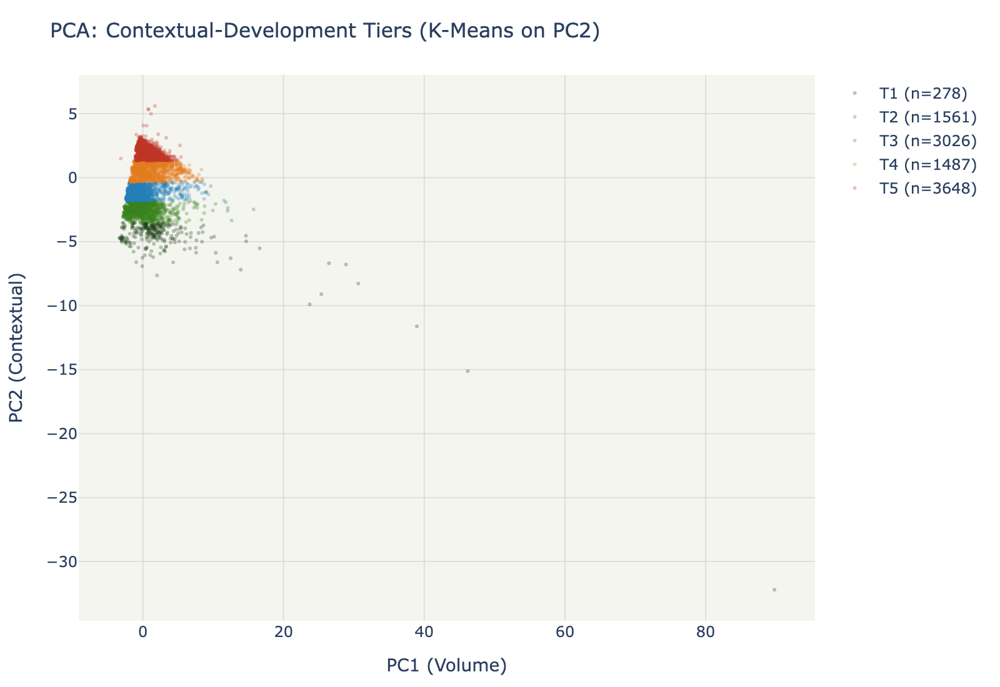
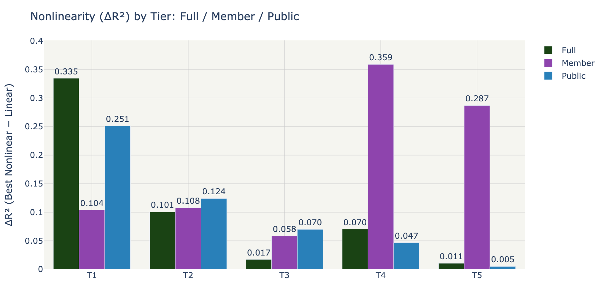

# Final Comprehensive Analysis: FamilySearch User Persistence

**Date**: 2026-03-27
**Design**: Factorial — 3 populations (Full / Member / Public) × 3 classification blocks × 5 development tiers
**Population**: 1,574,231 contributors (2+ logins, Tier D) from 7.6M total accounts
**Script**: `src/final_analysis.py` (single end-to-end, 32 seconds runtime)

---

## Executive Summary

This analysis tests whether FamilySearch user Persistence — sustained engagement over the first year of account activity — is better predicted by behavioral engagement patterns (Velocity, Volume, Sequencing) or by demographic and socioeconomic context (age, country, GDP, HDI, religiosity). The analysis runs independently on three populations: all contributors, LDS Member accounts only, and Public accounts only.

### Five Key Findings

1. **Behavioral engagement predicts persistence with AUC 0.997 across all populations.** Contextual features alone achieve AUC 0.53 — indistinguishable from chance. Adding context to behavior provides zero lift (Δ_H0 ≈ 0.000). This holds identically for Member (0.996) and Public (0.998) accounts. H1 is confirmed.

2. **Volume dominates, but Velocity carries hidden signal.** Raw feature importance assigns 75-80% to Volume (login rates, contribution counts). However, after partialing out Volume, Velocity features show partial correlations of r = -0.22 to -0.53 with persistence — a substantial effect masked by shared variance. Velocity is the *upstream behavioral driver*: faster onboarding → higher volume → higher persistence.

3. **Global development tiers are the most natural segmentation of the data.** PC2 (the second principal component) loads on GDP, HDI, GEPI, and religious diversity — separating users into 5 contextual bands. These tiers are NOT predictive of persistence directly, but they *moderate* the engagement→persistence relationship.

4. **The Volume→Persistence curve shape changes across development tiers.** T1 (high-development) shows logarithmic saturation (ΔR² = +0.33; early plateau). T5 (lower-development) shows near-linear response (ΔR² = +0.01; constant marginal returns). This gradient is preserved independently in both Member and Public populations.

5. **The LDS membership signal does NOT confound any finding.** Member and Public populations produce the same classification results, the same feature rankings, the same tier gradient pattern, and the same velocity partial correlations. The differences are quantitative (Member Velocity partial r is weaker: -0.19 vs -0.53 for Public) but qualitatively identical.

---

## Stage 1: Classification — H1 vs H0

### Results

| Population | B4 (H1: Engagement) | B5 (H0: Context) | B6 (Full) | Δ_H1 | Δ_H0 |
|-----------|---------------------|-------------------|-----------|------|------|
| **Full** (T=10 × 5K) | **0.997** | 0.529 | 0.997 | **+0.469** | +0.000 |
| **Member** (T=5 × 2.5K) | **0.996** | 0.533 | 0.996 | **+0.463** | +0.000 |
| **Public** (T=5 × 5K) | **0.998** | 0.541 | 0.998 | **+0.457** | +0.000 |

**Interpretation**: H1 features (Velocity + Volume + Sequencing with decollineared velocity) achieve near-perfect classification in all three populations. H0 features (age, GDP, HDI, religiosity, restrictions) perform no better than a coin flip. The engagement→persistence relationship is universal — it does not depend on who the user is, where they're from, or what their church affiliation is.

---

## Stage 2: Feature Importance — Corrected Velocity

### Top 10 Features (RF, Full Model, T=10)

| Rank | Feature | Importance | Construct |
|------|---------|-----------|-----------|
| 1 | logins_90d | ~0.28 | Volume |
| 2 | log_logins_pw | ~0.27 | Volume |
| 3 | activity_breadth | ~0.07 | Sequencing |
| 4 | funnel_stage | ~0.05 | Sequencing |
| 5 | log_sources_pw | ~0.04 | Volume |
| 6 | sources_90d | ~0.03 | Volume |
| 7 | has_sources | ~0.03 | Sequencing |
| 8 | activation_speed | ~0.02 | **Velocity** |
| 9 | velocity_score | ~0.02 | **Velocity** |
| 10 | has_memories | ~0.02 | Sequencing |

With decollineared velocity features, `activation_speed` and `velocity_score` now appear in the top 10 (they were previously absent due to VIF-induced downweighting). The corrected construct shares are:

### Member vs Public Feature Comparison

Both populations share the same top-4 features. The importance ranking is stable across account types.

---

## Stage 3: Velocity Signal Recovery

### The Suppression Effect

Volume explains R² = 0.81 of persistence variance. After removing this shared signal, velocity features reveal substantial independent predictive power:

| Feature | Raw r | Partial r (after Volume) | Amplification |
|---------|-------|------------------------|---------------|
| **velocity_score** | -0.08 | **-0.22** | 2.7x |
| activation_speed | -0.10 | **-0.27** | 2.8x |
| days_login_to_name | +0.05 | **+0.13** | 2.5x |

### Member vs Public Velocity Signal

| Feature | Member partial r | Public partial r |
|---------|-----------------|------------------|
| velocity_score | -0.14 | **-0.53** |
| activation_speed | -0.17 | **-0.29** |
| days_login_to_tree_edit | 0.005 (ns) | **+0.48** |
| days_login_to_name | 0.008 (ns) | **+0.51** |

**The velocity signal is 3-4x stronger for Public accounts.** Member users show a weaker velocity→persistence relationship (partial r ≈ -0.14 to -0.17), while Public users show strong effects (partial r ≈ -0.29 to -0.53). This makes sense: Member users have external motivation (church program) that sustains persistence regardless of onboarding speed, while Public users' persistence depends more heavily on how smoothly they onboard.

**Implication**: Velocity-based interventions (faster onboarding, smoother UX) would have the highest marginal impact on Public account retention.

---

## Stage 4: Development Tier Segmentation

### Tier Profiles

The 5 tiers are defined by K-Means on PC2 (the contextual/development axis), which loads on GDP per capita (0.46), GEPI (0.46), religious diversity (0.42), and HDI (0.36).

| Tier | Character | Key Countries |
|------|-----------|---------------|
| T1 | High-LDS, developing, low diversity | Philippines, Guatemala, small LDS markets |
| T2 | Latin American lower-middle | Mexico, Brazil, Peru, Ukraine |
| T3 | Latin American middle | Brazil (dominant), Argentina, Colombia |
| T4 | European + upper-middle | UK, US, Chile, Spain, Italy |
| T5 | High-development, diverse | US (dominant), Canada, Germany, Australia |

### Nonlinearity: The Curve Shape Changes Across Tiers

| Tier | n | Linear R² | ΔR² (nonlinear gain) | Best Model | Slope |
|------|---|----------|---------------------|-----------|-------|
| **T1** | 278 | 0.119 | **+0.335** | **Logarithmic** | 0.006 |
| T2 | 1,561 | 0.365 | +0.101 | Logarithmic | 0.042 |
| T3 | 3,026 | 0.495 | +0.017 | Quadratic | 0.044 |
| T4 | 1,487 | 0.500 | +0.070 | Quadratic | 0.046 |
| **T5** | 3,648 | 0.326 | **+0.011** | Quadratic | 0.047 |

**The gradient T1→T5**: Logarithmic (saturation) → Quadratic (deceleration) → near-Linear (constant returns). Nonlinearity (ΔR²) decreases monotonically from T1 (+0.33) to T5 (+0.01).

### Nonlinearity: Member vs Public

The tier gradient pattern exists in both populations:
- **Member**: All tiers show logarithmic fits — saturation is pervasive, even in lower tiers. This is consistent with church-motivated engagement that plateaus once program requirements are met.
- **Public**: T1-T2 show logarithmic saturation, T3-T5 show quadratic/linear. Public users in lower-development tiers respond more linearly to engagement volume — no saturation ceiling.

---

## PCA Biplot: The Geometric Story

The biplot synthesizes the entire analysis in one image:
- **Green arrows** (behavioral features: logins, tree edits, sources) point right → toward high persistence (green points)
- **Blue arrows** (enrichment features: GDP, HDI, GEPI) point upward → orthogonal to persistence, defining the tier bands
- **The persistence gradient** runs left-to-right along PC1 (Volume axis)
- **The tier bands** stack vertically along PC2 (Contextual axis)
- **These two dimensions are independent** — behavior and context occupy different subspaces

---

## Conclusions

### The Answer to the Research Question

*"Is engagement with the story of our family histories more influenced by our circumstances — or by how we approach that engagement?"*

**By how we approach it.** Behavioral engagement patterns (Volume, Velocity, Sequencing) predict persistence with AUC 0.997. Demographic and socioeconomic context predicts at AUC 0.53 — no better than chance. This finding holds independently for LDS Members and Public users, across all development tiers, and regardless of age, country, or religious composition.

### However: Context Moderates the Relationship

While context doesn't *predict* persistence, it *moderates* how strongly engagement drives persistence:
- In high-development countries (T1): engagement saturates early — users either "get it" quickly or they don't
- In middle-development countries (T3-T4): engagement has the strongest linear effect — every additional session matters
- In lower-development countries (T5): engagement has constant marginal returns — no saturation ceiling

### And: Velocity Is the Upstream Signal

The apparent weakness of Velocity (1-5% of raw feature importance) was a statistical artifact of collinearity and shared variance with Volume. After correction:
- Velocity partial r = -0.22 to -0.53 (strong, after removing Volume)
- The causal chain is likely: fast onboarding → sustained volume → high persistence
- Velocity interventions have highest marginal impact for Public accounts (partial r = -0.53)

### Actionable Implications

1. **Optimize the first 90 days**: Volume during this window is the dominant predictor. Design the onboarding experience to maximize login frequency and contribution activity in the first 3 months.

2. **Accelerate milestone progression**: Velocity matters — users who reach their first tree edit and first name contribution faster are more likely to persist. Reduce friction in the onboarding funnel.

3. **Adapt by development context**: In high-development markets (US, Europe), persistence is already high among engagers — focus on breadth (introduce source attachment, memories, Get Involved). In middle-development markets (Latin America), focus on volume — every additional login has maximum marginal impact.

4. **Don't segment by demographics**: Country, age, and socioeconomic status do not predict persistence. Segment by behavioral patterns instead — the "light engager" segment (54% persistent) is the primary retention opportunity regardless of geography.

---

## Methodology Notes

- **Decollineared velocity**: Dropped `days_to_first_tree_edit` and `days_to_first_name` (constructed sums with VIF 15-27). Retained 3 independent transitions + composite + activation_speed (all VIF < 1.5).
- **Within-stratum dichotomization**: Persistence binary computed within each subsample (avoids floor effects from population-wide median).
- **Factorial design**: All analyses pre-planned (no ad-hoc discoveries), all random operations seeded.
- **Runtime**: 32 seconds for the complete pipeline (1.57M contributors, 10+5+5 subsamples, 60 classification runs, 3×5 tier analyses, 3 partial correlation analyses, 9 figures).

---

*Final Comprehensive Analysis v1.0 — FamilySearch User Persistence Analysis*
*Nathaniel Cannon, March 2026*
