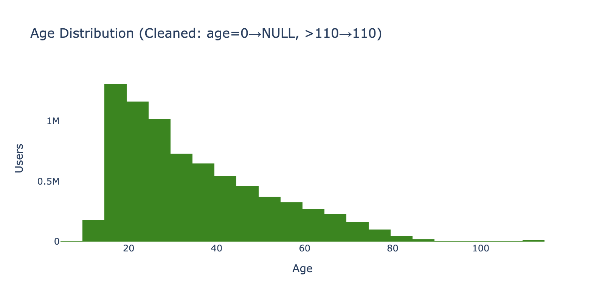
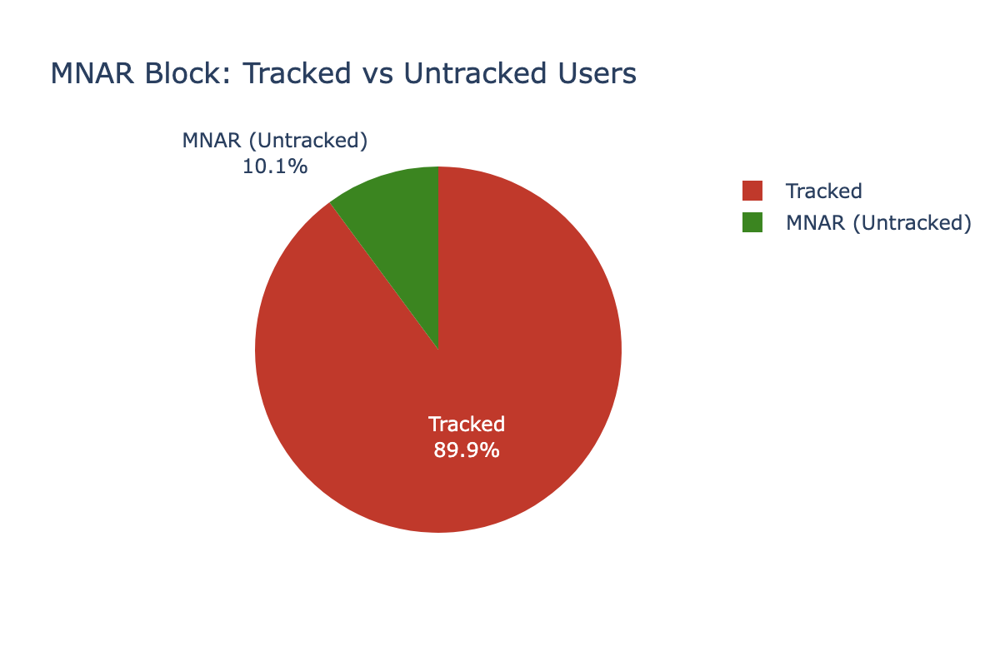
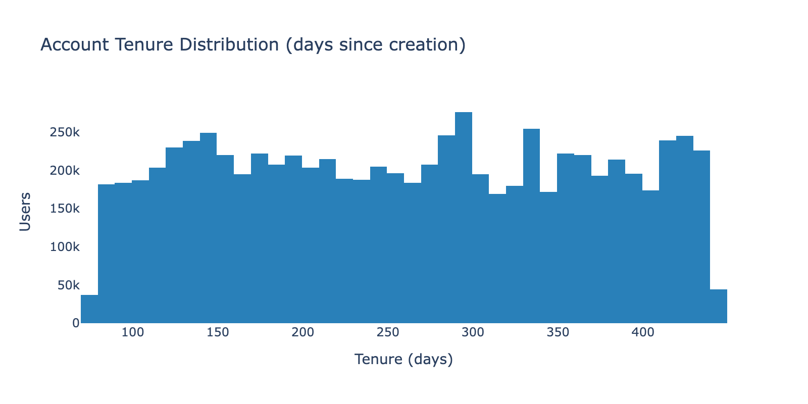
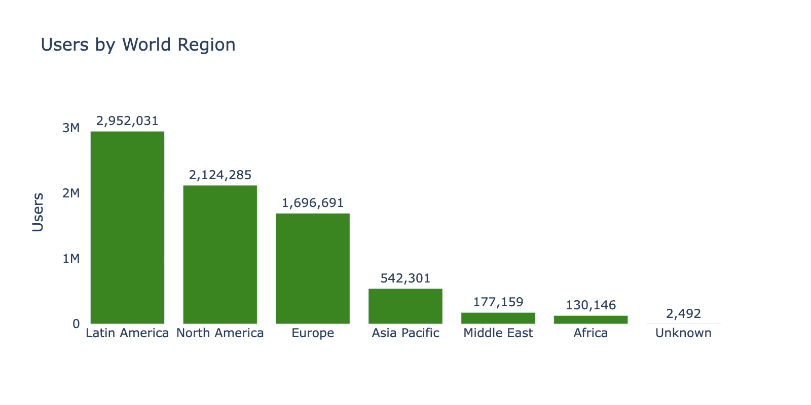
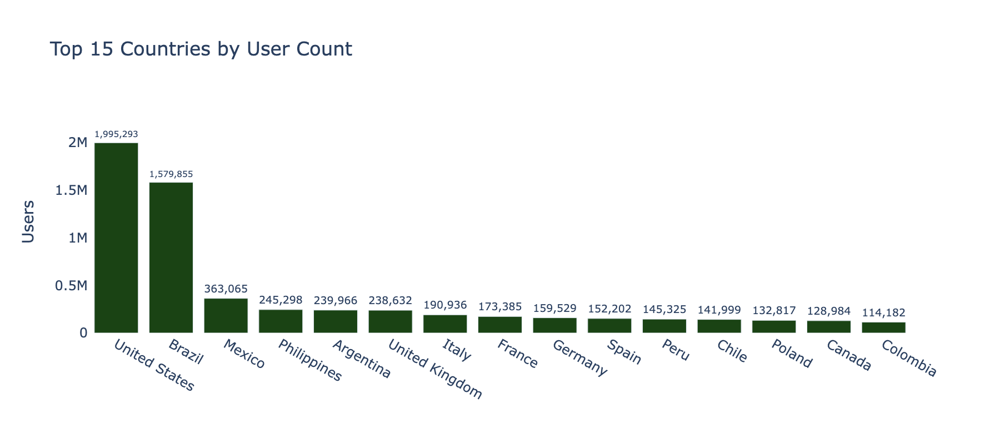

# Phase 1 Assessment: Data Infrastructure & Quality Control

**Date**: 2026-03-26
**Dataset**: FamilySearch User Segmentation (7.6M accounts, 33 columns)
**Database**: `data/familysearch.duckdb` (678 MB)
**Script**: `src/phase1_infrastructure.py`

---

## Executive Summary

Phase 1 loaded 7,625,105 user records from a 1.5GB CSV into a DuckDB analytical database, applied all cleaning rules, built an ISO-3166 country crosswalk, and established experiment tracking infrastructure. All 9 pipeline steps passed validation. Key findings: 23,134 invalid ages (negative values, not zeros as the 250K sample suggested), 771,519 MNAR-block users (10.12%), and 242 of 244 countries successfully mapped to ISO-3166 codes.

---

## Step Results

### 1.1 Raw Data Load

- **7,625,105 rows, 33 columns** loaded successfully
- All column types auto-detected correctly (BIGINT for IDs/ages, DOUBLE for activity counts, TIMESTAMP for dates, VARCHAR for categories)
- Load time: ~90 seconds from CSV symlink

### 1.2 Age Cleaning

| Rule | Count | % | Action |
|------|-------|---|--------|
| Age = 0 | 0 | 0% | N/A (not present in raw data) |
| Age < 0 (negative) | 23,134 | 0.30% | Set to NULL |
| Age 1-7 | 0 | 0% | N/A |
| Age > 110 | 16,720 | 0.22% | Clipped to 110 |
| **Total nullified** | **23,134** | **0.30%** | — |

**Key finding**: The raw data contains **negative ages** (not age=0 as the 250K parquet sample showed — pandas `clip(lower=0)` during sample creation converted negatives to zero). The minimum account age of 8 is enforced by the platform; the remaining valid ages start at 9.

**Post-cleaning distribution**: Min=9, Median=30, Mean=35.1, Max=110. Right-skewed (younger median than mean), consistent with the 250K sample analysis.

### 1.3 Province/City Sentinel Conversion

| Column | Sentinel | Count | % |
|--------|----------|-------|---|
| PROVINCE | "Unknown" | 7,417,060 | 97.3% |
| PROVINCE | "-" | 1,037 | 0.01% |
| CITY | "Unknown" | 7,379,755 | 96.8% |
| CITY | "Redacted" | 20,439 | 0.27% |
| CITY | "-" | 970 | 0.01% |
| CITY | NULL/empty | 10 | 0.00% |

All sentinel values converted to NULL. Province: 97.29% NULL post-conversion. City: 97.06% NULL. Retained for Member-only geographic analysis per methodology report.

### 1.4 MNAR Block Detection

- **771,519 users (10.12%)** have all 11 activity columns simultaneously NULL
- Verified as pure block missingness: `any_activity_null_count == mnar_block_count` (no partial nulls)
- Detection logic: all of DAYS_LOGGING_IN, SOURCES_ADDED, DAYS_ADDING_SOURCES, MEMORIES_ADDED, DAYS_ADDING_MEMORIES, GET_INVOLVED_ITEMS_REVIEWED, DAYS_REVIEWING_GET_INVOLVED_ITEMS, RECORD_EDITS, DAYS_EDITING_RECORDS, TREE_EDITS, DAYS_EDITING_TREES must be NULL

### 1.5 Reference Date & Tenure

- **Reference date**: 2026-03-18 (inferred from MAX across all date columns; SOURCE_CONTRIBUTOR had the latest at 2026-03-18)
- **Tenure range**: 78 to 441 days (median 262, mean 260.8)
- **Zero negative tenures** — all accounts created before the reference date
- Note: minimum tenure of 78 days means the 31-day exclusion threshold (Phase 4) will not remove any users

### 1.6 ISO-3166 Country Crosswalk

- **244 distinct country values** in the dataset (vs 215 in the 250K sample — full data reveals more rare countries)
- **242 matched** to ISO-3166 alpha-3 codes (99.2%)
- **2 null-mapped**: "Unknown" and "-" (deliberately mapped to NULL)
- **0 unmatched** after manual overrides for FamilySearch-specific names (e.g., "D.R. Congo"→COD, "Turkey"→TUR via Türkiye rename, "St. Kitts and Nevis"→KNA, "Channel Islands"→GBR)

### 1.7 users_clean Table

- **7,625,105 rows** (matches raw — no row loss)
- **37 columns** (original 33 + is_mnar, tenure_days, tenure_weeks, iso3_code)
- All transformations verified: age min=9/max=110, tenure non-negative, MNAR count matches step 1.4

### 1.8-1.9 Tracking & QC

- `experiment_registry` and `qc_log` tables created
- Full QC summary logged: NULL rates per column, tenure/age distributions, region/country/account type breakdowns
- ISO3 coverage: 99.96% of users have a mapped country code

---

## Geographic Overview

| Region | Users | % |
|--------|-------|---|
| Latin America | 2,952,031 | 38.7% |
| North America | 2,124,285 | 27.9% |
| Europe | 1,696,691 | 22.3% |
| Asia Pacific | 542,301 | 7.1% |
| Middle East | 177,159 | 2.3% |
| Africa | 130,146 | 1.7% |
| Unknown | 2,492 | 0.03% |

---

## Database Schema

| Table | Rows | Columns | Purpose |
|-------|------|---------|---------|
| `users_raw` | 7,625,105 | 33 | Original CSV data, untransformed |
| `users_clean` | 7,625,105 | 37 | Cleaned: ages, sentinels, MNAR flag, tenure, ISO3 |
| `country_crosswalk` | 244 | 3 | FS country name → ISO3 mapping |
| `experiment_registry` | 0 | 11 | Phase 4+ experiment tracking |
| `qc_log` | ~80 | 5 | All QC metrics from all phases |

---

*Phase 1 Assessment v1.0 — FamilySearch User Persistence Analysis*
