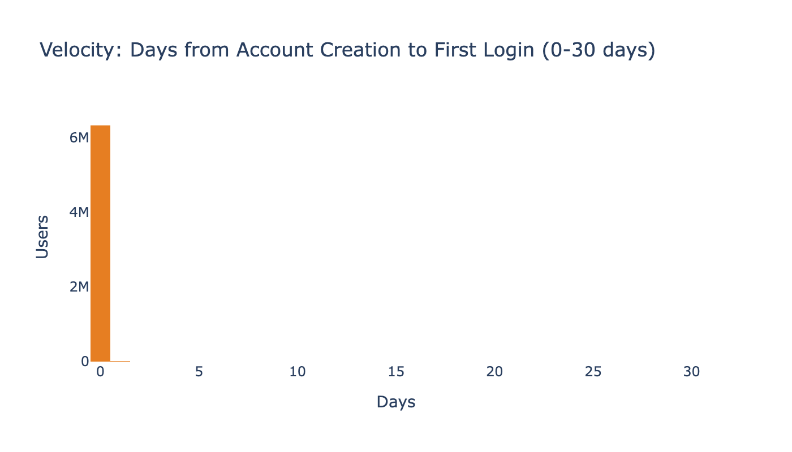
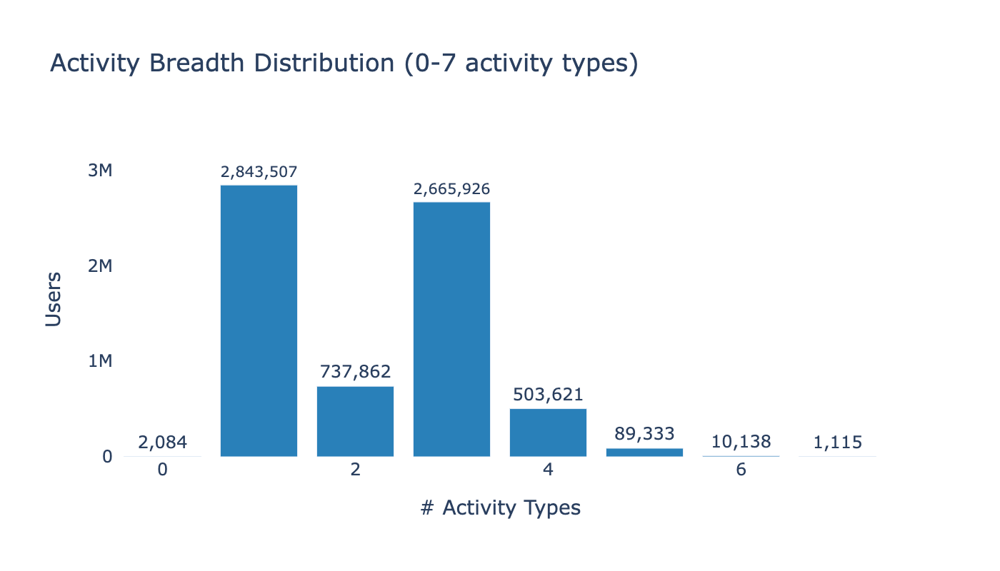
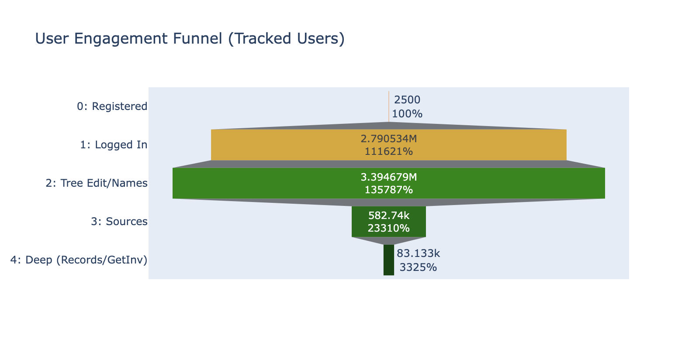
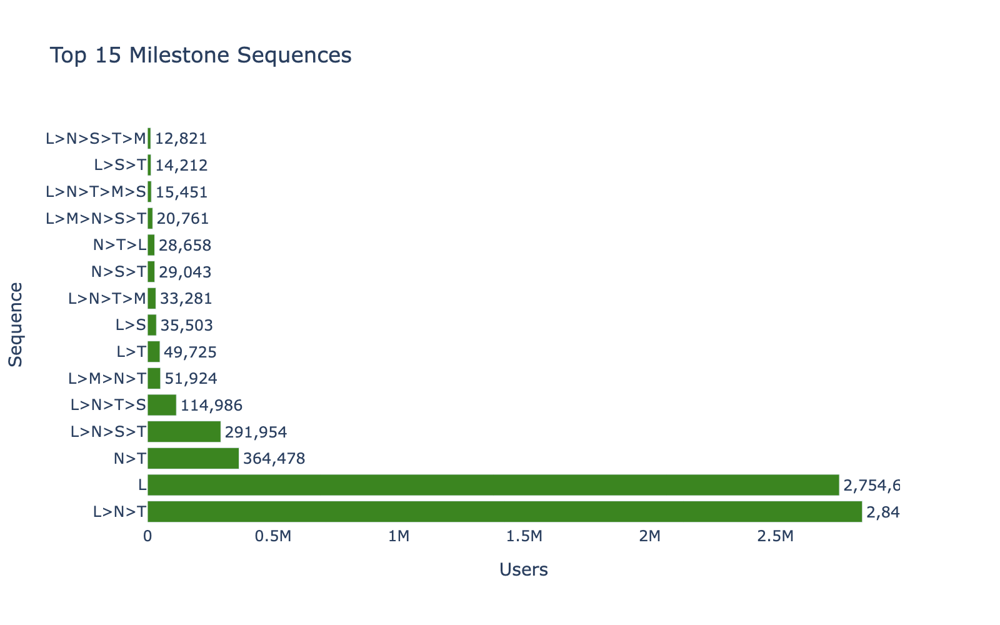
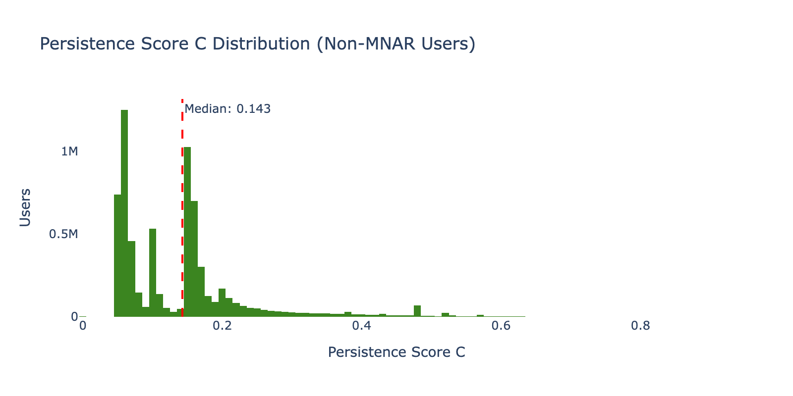
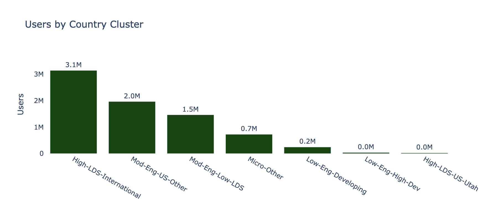

# Phase 2 Assessment: Feature Engineering

**Date**: 2026-03-26
**Input**: `users_clean` (7,625,105 rows, 37 columns)
**Output**: `users_features` (7,625,105 rows, 79 columns — 42 new features)
**Scripts**: `src/phase2_features.py` (SQL features), `src/phase2_finish.py` (sequence encoding + dichotomization)

---

## Executive Summary

Phase 2 derived 42 new features across all four analytical constructs: Velocity (6 features), Volume (12 features — tenure-normalized + fixed-window + log-transformed), Sequencing (10 features — binary flags, breadth, funnel stage, milestone sequence), and Persistence (5 features — 3 score definitions + 2 dichotomizations). Additionally, country clusters (7 categories), age groups (8 bins), login consistency, and tenure weight were computed. All 7.6M rows preserved; no data loss.

---

## Construct Coverage

### Velocity (6 features)

Measures time between successive milestones.

| Feature | Non-NULL | Median | Mean | Description |
|---------|---------|--------|------|-------------|
| `days_to_first_login` | 84.4% | 0 | 0.97 | Account creation → first login |
| `days_login_to_tree_edit` | 50.2% | — | — | First login → first tree edit |
| `days_login_to_name` | 49.4% | — | — | First login → first name contribution |
| `days_tree_to_source` | 7.5% | — | — | First tree edit → first source (Tier E only) |
| `days_to_first_tree_edit` | 53.0% | — | — | Account creation → first tree edit |
| `days_to_first_name` | 51.9% | — | — | Account creation → first name |

**Key finding**: Median days_to_first_login = 0 — most users who ever log in do so on the same day they create the account. Mean = 0.97 days.

**Activation speed composite**: Mean 0.89 (range 0-1). The distribution is heavily right-skewed toward 1.0, meaning most users who activate do so almost immediately.

### Volume (12 features)

Rates of contribution measured two ways: tenure-normalized (per-week over full account lifetime) and fixed-window (prorated to 90-day window).

| Feature | Mean | Description |
|---------|------|-------------|
| `logins_per_week` | 0.113 | Login days per week (tenure-normalized) |
| `tree_edits_per_week` | 0.586 | Tree edits per week |
| `names_per_week` | 0.152 | Names added per week |
| `sources_per_week` | 0.018 | Sources added per week |
| `logins_90d` | — | Login days in first 90 days (prorated) |
| `tree_edits_90d` | — | Tree edits in first 90 days (prorated) |
| `log_logins_pw` | — | Log1p of logins per week |
| `log_tree_edits_pw` | — | Log1p of tree edits per week |

Plus 4 log-transformed raw count features (`log_days_logging_in`, `log_tree_edits`, `log_names_added`, `log_sources_added`).

### Sequencing (10 features)

| Feature | Values | Description |
|---------|--------|-------------|
| `has_login` | 0/1 | Binary: ever logged in |
| `has_tree_edits` | 0/1 | Binary: ever edited tree |
| `has_names` | 0/1 | Binary: ever added names |
| `has_sources` | 0/1 | Binary: ever added sources |
| `has_memories` | 0/1 | Binary: ever added memories |
| `has_record_edits` | 0/1 | Binary: ever edited records |
| `has_get_involved` | 0/1 | Binary: ever used Get Involved |
| `activity_breadth` | 0-7 | Count of activity types with any engagement |
| `funnel_stage` | 0-4 | Furthest milestone reached |
| `milestone_sequence` | String | Ordered milestone codes (e.g., "L>N>T") |

**Activity breadth**: Mean 2.17 (non-MNAR users). Distribution peaks at 1 (login only) and 3 (login + tree + names).

**Funnel stage distribution**:

| Stage | Users | % of Tracked |
|-------|-------|-------------|
| 0: Registered only | 2,500 | 0.04% |
| 1: Logged in | 2,790,534 | 40.7% |
| 2: Tree edit/Names | 3,394,679 | 49.5% |
| 3: Sources | 582,740 | 8.5% |
| 4: Deep (Records/Get Involved) | 83,133 | 1.2% |

**Milestone sequences**: 1,184 distinct patterns. Top sequences:

| Sequence | Users | % | Interpretation |
|----------|-------|---|---------------|
| `L>N>T` | 2,846,091 | 37.3% | Login → Names → Tree (most common path) |
| `L` | 2,754,658 | 36.1% | Login only (never contributed) |
| `N>T` | 364,478 | 4.8% | Names → Tree, no login (non-login contributors) |
| `L>N>S>T` | 291,954 | 3.8% | Full 4-step path with sources |
| `L>N>T>S` | 114,986 | 1.5% | Alternate ordering: sources came after tree |

### Persistence (5 features)

**Three score definitions** (computed for all non-MNAR users):

| Definition | Mean | Min | Max | Description |
|-----------|------|-----|-----|-------------|
| A: Login Consistency | 0.113 | 0 | 7+ | DAYS_LOGGING_IN / tenure_weeks |
| B: Activity Spread | 0.017 | 0 | ~1 | Time span of milestones / tenure |
| C: Composite (recommended) | 0.140 | 0 | 0.903 | Weighted: login consistency + recency + breadth |

**Persistence correlations**:
- A ↔ C: **r = 0.69** (strong — C is partially built from A)
- A ↔ B: r = 0.05 (near zero — login consistency and activity spread measure different things)
- B ↔ C: r = 0.16 (weak — spread contributes minimally to the composite)

**Dichotomization** (Definition C):
- Median split (0.143): 3,423,978 Transient (50.0%) / 3,429,608 Persistent (50.0%)
- Tertile split: Low 33.3% / Mid 33.4% / High 33.4%

---

## Country Clusters

| Cluster | Users | % |
|---------|-------|---|
| High-LDS-International | 3,145,563 | 41.3% |
| Mod-Eng-US-Other | 1,968,626 | 25.8% |
| Mod-Eng-Low-LDS | 1,466,764 | 19.2% |
| Micro-Other | 729,222 | 9.6% |
| Low-Eng-Developing | 247,722 | 3.2% |
| Low-Eng-High-Dev | 40,541 | 0.5% |
| High-LDS-US-Utah | 26,667 | 0.3% |

---

## Data Quality Notes

1. **All 7,625,105 rows preserved** — no row loss during feature engineering
2. **MNAR users get NULL** for all derived features that depend on activity data (Velocity, Volume, Persistence). They retain demographic features (age, country, tenure).
3. **Milestone sequence encoding** used DuckDB UNPIVOT + STRING_AGG (seconds) after an initial row-by-row approach was killed after 4+ hours at 17% completion.
4. **Persistence Definition B** has very low correlation with A and C (r ≈ 0.05-0.16) — it measures a fundamentally different aspect of engagement (temporal spread of milestones vs. frequency of login). This is expected and desirable: the three definitions provide complementary views.

---

*Phase 2 Assessment v1.0 — FamilySearch User Persistence Analysis*
