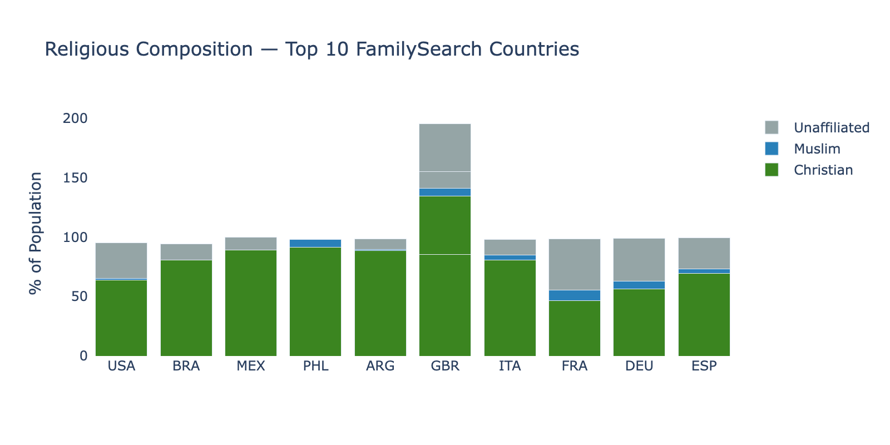
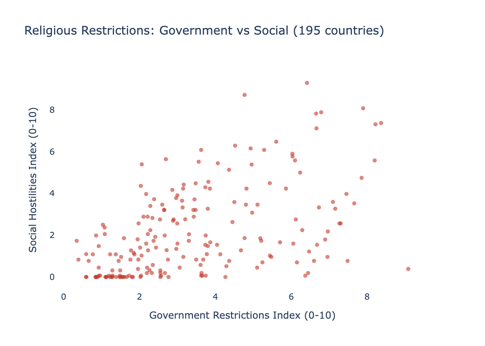
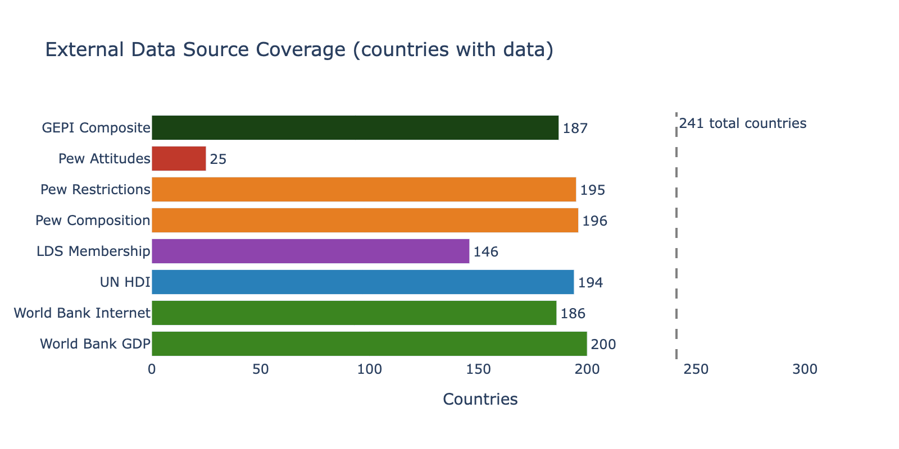
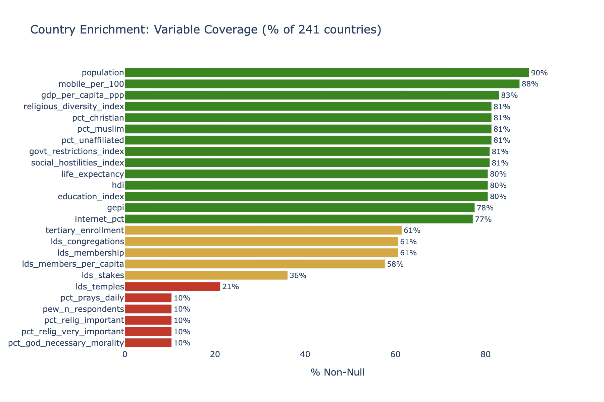
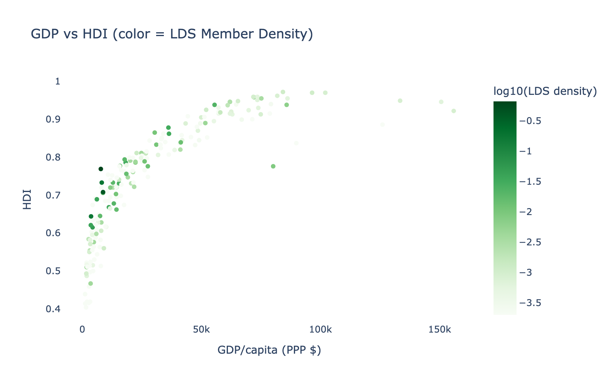

# Phase 3 Assessment: External Data Enrichment

**Date**: 2026-03-26
**Database**: `country_enrichment` table — 241 countries, 26 columns
**Sources**: World Bank WDI, UN HDI, LDS Church Statistics, Pew Religious Composition, Pew Religious Restrictions, Pew Global Attitudes
**Scripts**: `src/phase3_enrichment.py`, `src/phase3_pew_integration.py`

---

## Executive Summary

Phase 3 acquired country-level contextual variables from 6 external sources, building a 26-column enrichment table covering 241 countries. Three sources achieved near-universal coverage (99%+): World Bank economic indicators, UN Human Development Index, and Pew Religious Composition/Restrictions data. The LDS Church Statistics GitHub dataset covered 146 countries (61%) with membership data. The Pew Global Attitudes survey provides behavioral religiosity metrics for 24 countries covering 53% of FamilySearch users. A GEPI (Genealogy Engagement Propensity Index) composite was computed for 187 countries. Three sources were deferred: ITU IDI (auth required), Pew Attitudes full dataset (already integrated from downloaded files), and Google Trends (API unavailable).

---

## Source-by-Source Results

### World Bank WDI (via `wbgapi` Python API)

| Indicator | Coverage | Description |
|-----------|---------|-------------|
| GDP per capita (PPP $) | **199 countries (83%)** | Most recent available year (2022-2024) |
| Internet users % | **185 countries (77%)** | % of population using internet |
| Mobile subscriptions per 100 | **210 countries (88%)** | Mobile cellular subscriptions |
| Tertiary enrollment % | **147 countries (61%)** | Gross enrollment in tertiary education |
| Population | **217 countries (90%)** | Total population |

**User coverage**: 98.8% of FamilySearch users have GDP data for their country.

### UN Human Development Index (direct CSV download)

| Indicator | Coverage | Description |
|-----------|---------|-------------|
| HDI (2023) | **194 countries (80%)** | Composite development index (0.388-0.972) |
| Education index | **194 countries (80%)** | Expected years of schooling (male, 2023) |
| Life expectancy | **194 countries (80%)** | Life expectancy at birth (male, 2023) |

**User coverage**: 99.4% of FamilySearch users have HDI data.

### LDS Church Statistics (GitHub community CSV)

| Indicator | Coverage | Description |
|-----------|---------|-------------|
| Total membership | **146 countries (61%)** | Church membership count |
| Congregations | **146 countries (61%)** | Wards + branches |
| Temples | **51 countries (21%)** | Operating + under construction |
| Stakes | **87 countries (36%)** | Organizational units |
| Members per capita | **139 countries (58%)** | Membership / population |

**User coverage**: 96.8% of FamilySearch users have LDS membership data. The coverage gap is mostly small countries without an LDS presence.

### Pew Religious Composition (2020)

| Indicator | Coverage | Description |
|-----------|---------|-------------|
| % Christian | **196 countries (81%)** | Christian population share |
| % Muslim | **196 countries (81%)** | Muslim population share |
| % Unaffiliated | **196 countries (81%)** | Religiously unaffiliated share |
| Religious Diversity Index | **196 countries (81%)** | RDI score (0-10) |

**User coverage**: ~99.6% of FamilySearch users.

### Pew Religious Restrictions (2022)

| Indicator | Coverage | Description |
|-----------|---------|-------------|
| Government Restrictions Index (GRI) | **195 countries (81%)** | Scale 0-10 (0.34-9.09 observed) |
| Social Hostilities Index (SHI) | **195 countries (81%)** | Scale 0-10 (0.00-9.29 observed) |

**User coverage**: ~99.3% of FamilySearch users.

### Pew Global Attitudes Spring 2025

| Indicator | Coverage | Description |
|-----------|---------|-------------|
| % religion important | **24 countries (10%)** | Very + somewhat important |
| % religion very important | **24 countries (10%)** | Very important only |
| % prays daily | **24 countries (10%)** | Several times + once a day |
| % God necessary for morality | **24 countries (10%)** | Believe in God required for moral values |

**User coverage**: 53% of FamilySearch users (the 24 surveyed countries include Brazil, Mexico, Argentina, Australia, and most European countries).

**Country-level religiosity scores** (selected):

| Country | % Religion Important | % Prays Daily | FS Users |
|---------|---------------------|--------------|---------|
| Indonesia | 100.0% | 95.6% | 33,314 |
| Kenya | 97.3% | 85.4% | 6,390 |
| Nigeria | 95.5% | 82.3% | 14,586 |
| India | 93.9% | 79.5% | 17,770 |
| Brazil | 86.4% | 76.2% | 1,579,855 |
| Mexico | 79.1% | 41.6% | 363,065 |
| Argentina | 58.7% | 41.5% | 239,966 |
| Australia | 30.3% | 15.1% | 99,227 |
| France | 33.0% | 12.6% | 173,385 |
| Sweden | 27.8% | 8.6% | 25,012 |

### Deferred Sources

| Source | Reason | Impact | Mitigation |
|--------|--------|--------|-----------|
| ITU IDI | HTTP 401 (auth changed) | Missing ICT Development Index | WDI `internet_pct` substitutes |
| Google Trends | `pytrends` archived; official API closed-alpha | No genealogy search interest proxy | Exclude from GEPI; defer to manual export if needed |

---

## Enrichment Coverage Overview

### Coverage Tiers

| Tier | Variables | Country Coverage | User Coverage | Role in Analysis |
|------|----------|-----------------|--------------|-----------------|
| **Tier 1 (80%+)** | GDP, HDI, education, life expectancy, % Christian, % Muslim, diversity index, GRI, SHI | 194-200 countries | 98-99%+ | Primary H0 features in Phase 5 |
| **Tier 2 (60-80%)** | Internet %, mobile, LDS membership, LDS density, GEPI, tertiary enrollment | 139-210 countries | 90-98% | Secondary H0 features |
| **Tier 3 (10%)** | Behavioral religiosity (importance, prayer, morality) | 24 countries | 53% | 24-country subanalysis only |

### GEPI Composite

The Genealogy Engagement Propensity Index was computed from 4 standardized z-score components:
- GDP per capita (PPP)
- Internet penetration %
- HDI
- LDS members per capita

**Coverage**: 187 countries (78%), 98.7% of users.
**Range**: -1.81 to +1.85 (z-score scale).

---

## Final Enrichment Schema

| Column | Type | Non-NULL | % | Source |
|--------|------|---------|---|--------|
| iso3_code | VARCHAR | 241 | 100% | Crosswalk |
| gdp_per_capita_ppp | DOUBLE | 200 | 83% | World Bank |
| internet_pct | DOUBLE | 186 | 77% | World Bank |
| mobile_per_100 | DOUBLE | 211 | 88% | World Bank |
| tertiary_enrollment | DOUBLE | 148 | 61% | World Bank |
| population | DOUBLE | 216 | 90% | World Bank |
| hdi | DOUBLE | 194 | 80% | UN HDI |
| education_index | DOUBLE | 194 | 80% | UN HDI |
| life_expectancy | DOUBLE | 194 | 80% | UN HDI |
| lds_membership | DOUBLE | 146 | 61% | LDS GitHub |
| lds_congregations | DOUBLE | 146 | 61% | LDS GitHub |
| lds_temples | DOUBLE | 51 | 21% | LDS GitHub |
| lds_stakes | DOUBLE | 87 | 36% | LDS GitHub |
| lds_members_per_capita | DOUBLE | 139 | 58% | Computed |
| gepi | DOUBLE | 187 | 78% | Composite |
| pct_christian | DOUBLE | 196 | 81% | Pew Composition |
| pct_muslim | DOUBLE | 196 | 81% | Pew Composition |
| pct_unaffiliated | DOUBLE | 196 | 81% | Pew Composition |
| religious_diversity_index | DOUBLE | 196 | 81% | Pew Diversity |
| govt_restrictions_index | DOUBLE | 195 | 81% | Pew Restrictions |
| social_hostilities_index | DOUBLE | 195 | 81% | Pew Restrictions |
| pew_n_respondents | DOUBLE | 25 | 10% | Pew Attitudes |
| pct_relig_important | DOUBLE | 25 | 10% | Pew Attitudes |
| pct_relig_very_important | DOUBLE | 25 | 10% | Pew Attitudes |
| pct_prays_daily | DOUBLE | 25 | 10% | Pew Attitudes |
| pct_god_necessary_morality | DOUBLE | 25 | 10% | Pew Attitudes |

---

## Implications for Phase 5 (Discriminant Analysis)

The enrichment table provides **11 Tier 1-2 variables** with 80%+ country coverage suitable for the H0 (Context-Driven Persistence) feature block:

1. `gdp_per_capita_ppp` — economic development
2. `hdi` — composite human development
3. `education_index` — educational attainment
4. `internet_pct` — digital infrastructure
5. `pct_christian` — religious composition (LDS-relevant)
6. `religious_diversity_index` — religious landscape complexity
7. `govt_restrictions_index` — freedom of religious practice
8. `social_hostilities_index` — social environment for religion
9. `lds_members_per_capita` — LDS institutional presence
10. `lds_congregations` — LDS organizational density
11. `gepi` — composite genealogy engagement propensity

These variables enter Phase 5 Block 5 (H0 features) to test whether contextual factors predict Persistence better than behavioral engagement patterns (Block 4, H1 features).

---

*Phase 3 Assessment v1.0 — FamilySearch User Persistence Analysis*
