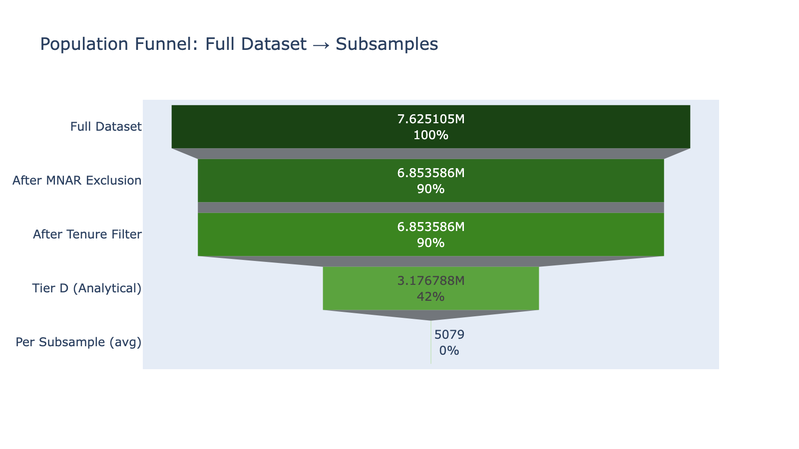
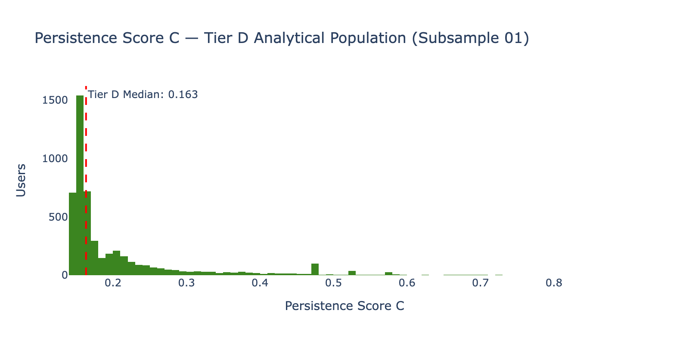
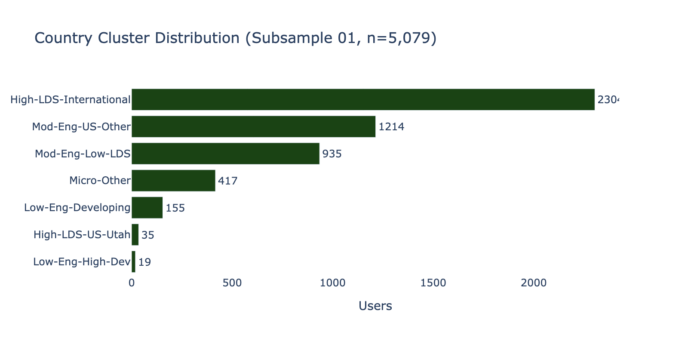
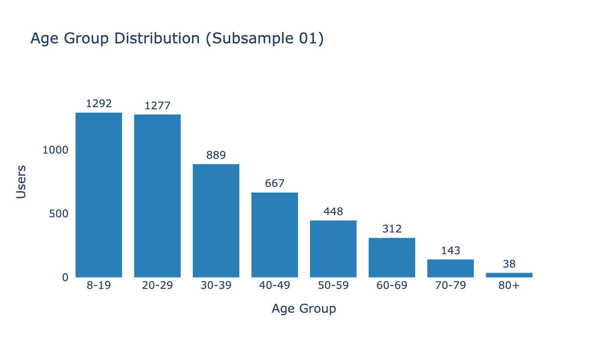
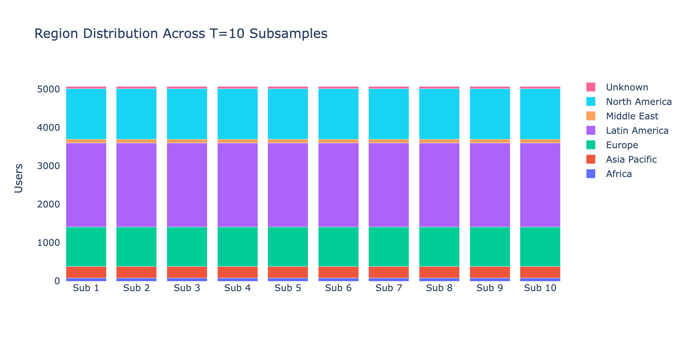

# Phase 4 Assessment: Subsampling & Data Partitioning

**Date**: 2026-03-26
**Input**: `users_features` (7,625,105 rows, 79 features) + `country_enrichment` (241 countries, 26 columns)
**Output**: 10 Parquet files in `data/subsamples/`, each 5,079 rows × 91 columns
**Script**: `src/phase4_subsampling.py`

---

## Executive Summary

Phase 4 applied exclusions (MNAR block + tenure < 31 days), segmented the tracked population into activity tiers, defined the Tier D analytical population (3,176,788 users = 41.7%), drew T=10 reproducible stratified subsamples of ~5,000 users each, joined enrichment data, and split each subsample 70/30 for train/test. A critical finding: the persistence dichotomization computed on the full population assigned ALL Tier D users to "Persistent" (since Tier D users by definition have login + tree edits + names, placing them above the population-wide median). The dichotomization must be recomputed within Tier D — addressed in Phase 5.

---

## Population Funnel

| Stage | Users | % of Raw | Action |
|-------|-------|---------|--------|
| Full dataset | 7,625,105 | 100% | — |
| After MNAR exclusion | 6,853,586 | 89.9% | 771,519 MNAR users removed |
| After tenure ≥ 31d | 6,853,586 | 89.9% | 0 removed (min tenure = 78d) |
| **Tier D (analytical)** | **3,176,788** | **41.7%** | Login + tree edits + names + all 3 dates |
| Per subsample (×10) | 5,079 | 0.07% | Stratified draw, seed-reproducible |

Note: the tenure filter removed zero users because the minimum account tenure in the dataset is 78 days (the data was extracted ~3 months after the earliest account creation date in the file).

---

## Activity Segmentation

| Segment | Users | % | Description |
|---------|-------|---|-------------|
| A_MNAR | 771,519 | 10.1% | Untracked by pipeline (excluded) |
| X_SHORT_TENURE | 0 | 0.0% | Tenure < 31 days (none in this dataset) |
| B_NO_ACTIVITY | 1,923 | 0.0% | Tracked, zero everything |
| C_NONLOGIN_CONTRIB | 434,268 | 5.7% | No logins but has contributions (API users) |
| D_SINGLE_BROWSE | 2,088,647 | 27.4% | 1 login, no contributions |
| E_LIGHT | 2,843,164 | 37.3% | 1-2 logins with some activity |
| F_MODERATE | 1,035,774 | 13.6% | 3-10 logins |
| G_REGULAR | 349,642 | 4.6% | 11-50 logins |
| H_POWER | 98,789 | 1.3% | 51+ logins |

---

## Tier D Analytical Population

**Definition**: Users with `DAYS_LOGGING_IN > 0` AND `TREE_EDITS > 0` AND `TOTAL_NAMES_ADDED > 0` AND all three milestone dates non-null (login, tree edit, name).

**Size**: 3,176,788 users (41.7% of raw, ~3.25M after enrichment join expanded slightly due to the LEFT JOIN).

**Persistence C within Tier D**:
- Min: 0.148 (floor imposed by having login + tree + names)
- Median: 0.163
- Mean: 0.206
- Max: 0.887
- Note: the population-wide median (0.143) is BELOW the Tier D floor — Phase 5 recomputes the median split within Tier D

---

## Subsampling Design

- **T = 10** independent subsamples, seeds 43-52
- **n = 5,079** per subsample (slightly above 5,000 target due to Cochran floor rounding)
- **Stratification**: country_cluster × USER_WORLD_REGION (22 strata after pooling 3 small strata into "Other|Pooled")
- **Cochran floor**: m = 15 per stratum (ensures even rare country×region combinations are represented)
- **Train/test split**: 70/30, stratified by persistence_c tertile → ~3,555 train / ~1,524 test per subsample

### Country Cluster Distribution in Subsamples

### Age Group Distribution

### Region Consistency Across Subsamples

The stacked bar chart confirms that all 10 subsamples have nearly identical region distributions — the stratified sampling is working as intended.

---

## Enrichment Coverage in Subsamples

| Variable | Non-null | % Coverage | Source |
|----------|---------|-----------|--------|
| gdp_per_capita_ppp | 49,958 | 98.4% | World Bank |
| hdi | 50,192 | 98.8% | UN HDI |
| pct_christian | 50,401 | 99.2% | Pew Composition |
| lds_members_per_capita | 49,026 | 96.5% | LDS GitHub |
| pct_relig_important | 26,683 | 52.5% | Pew Attitudes (24 countries) |
| govt_restrictions_index | ~99% | ~99% | Pew Restrictions |
| religious_diversity_index | ~99% | ~99% | Pew Diversity |

All Tier 1-2 enrichment variables have 96%+ coverage in the subsamples. The Pew Attitudes behavioral religiosity variables cover 52.5% — available for the 24 surveyed countries that dominate our user base.

---

## Subsample Registry

All 10 subsamples registered in `experiment_registry` table with:
- Phase identifier ("phase4")
- Seed per subsample (43-52)
- Row counts (train/test)
- Exclusion criteria documented
- Persistence rate and mean tenure logged as parameters

---

## Critical Issue: Persistence Dichotomization

**Problem identified**: The `persist_median` column computed in Phase 2 used the full tracked population's median (0.143). Since Tier D users all have persistence_c ≥ 0.148 (they have login + tree + names by definition), every user in the subsamples is classified as "Persistent" (persist_median = 1 for all 50,790 rows).

**Resolution**: Phase 5 recomputes the median split within the Tier D population (median = 0.163), producing balanced classes for classification. This is methodologically correct — we're asking "among users who DO engage, what distinguishes those who persist from those who don't?" rather than "what distinguishes engaged users from inactive ones?"

---

## Files Produced

| File | Size | Content |
|------|------|---------|
| `data/subsamples/subsample_01.parquet` through `subsample_10.parquet` | ~1.5 MB each | 5,079 rows × 91 columns (features + enrichment + split indicator) |
| `outputs/phase4/subsampling_report.md` | QC log | Full step-by-step metrics |
| `outputs/phase4/qc_log.json` | Machine-readable | All QC entries |

---

*Phase 4 Assessment v1.0 — FamilySearch User Persistence Analysis*
