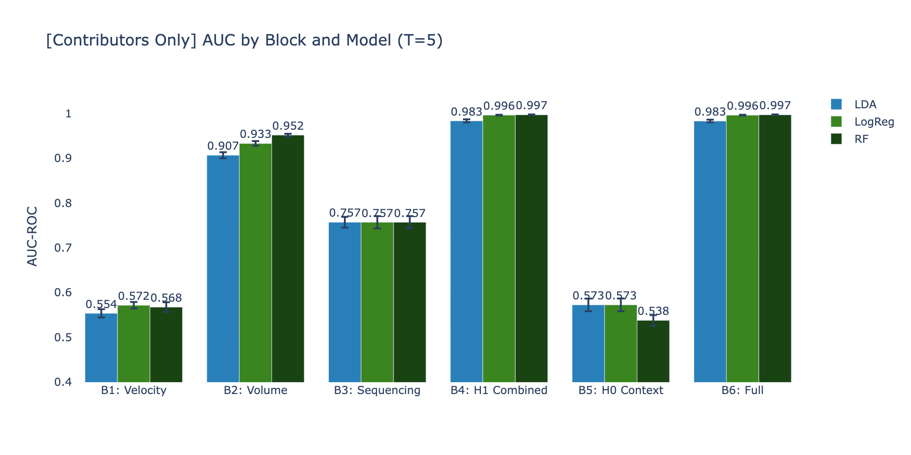
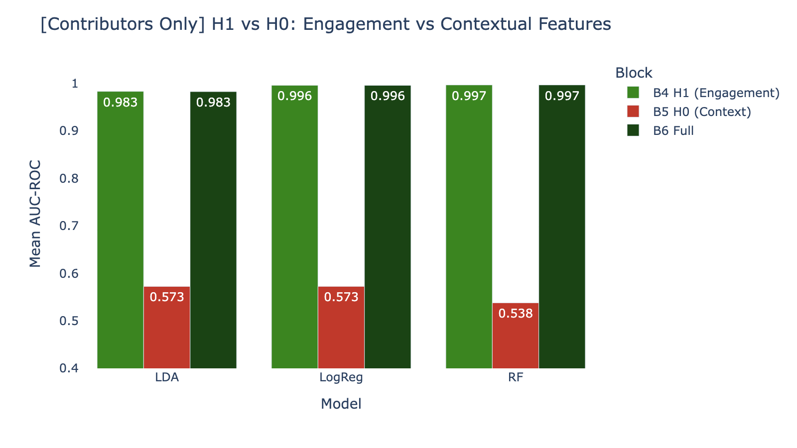
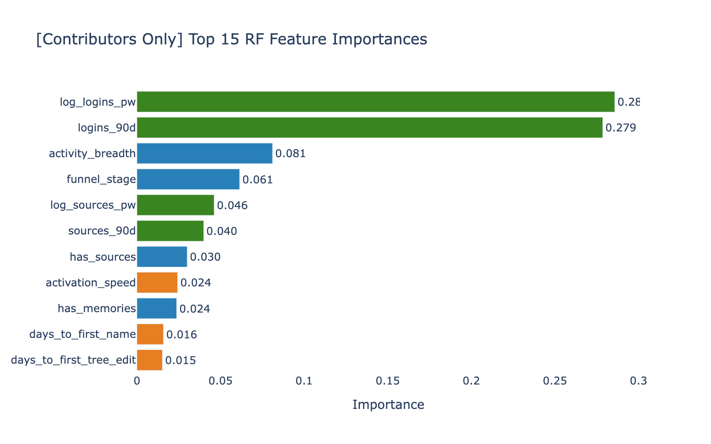
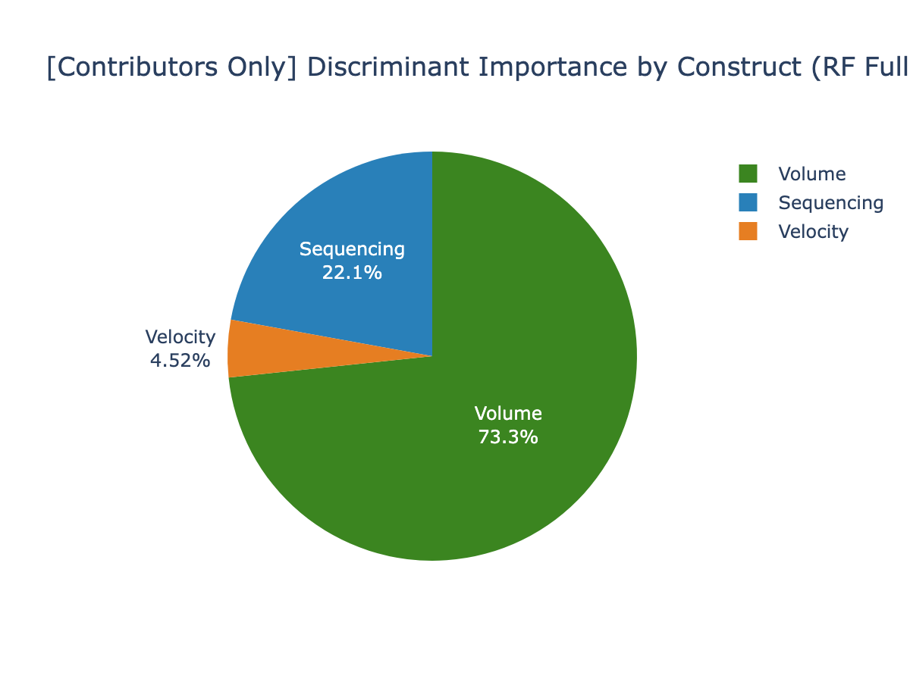
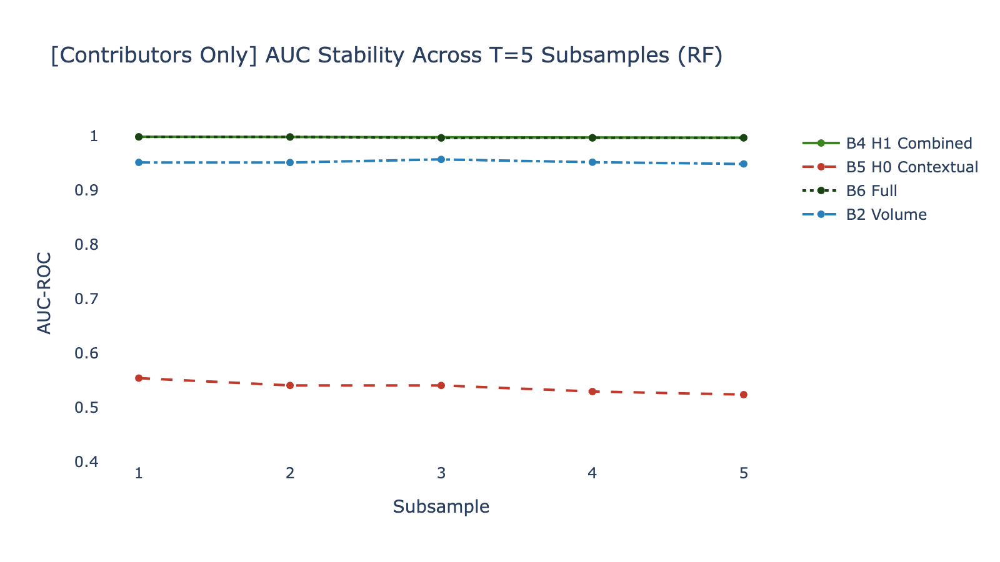
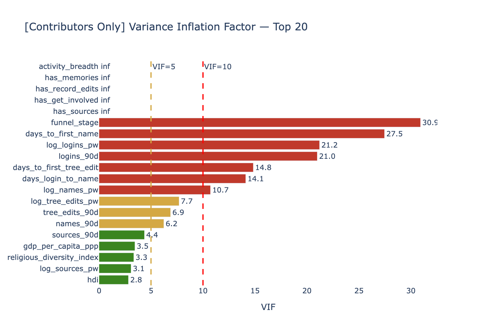

# Phase 5b Assessment: Supervised Classification (Contributors Only)

**Date**: 2026-03-26
**Population**: Contributors Only — users with 2+ logins (filtered from Tier D)
**Input**: T=5 paired subsamples (~4,950 users each, from pairing original T=10)
**Output**: 90 model runs (6 blocks × 3 models × 5 subsamples)
**Script**: `src/phase5b_contributors.py`

---

## Executive Summary

Phase 5b replicated the Phase 5 discriminant analysis after removing the 51% of Tier D users who logged in only once. This "contributors-only" filter produces a harder classification problem — all remaining users have demonstrated multi-session engagement, so the target variable (Persistence) has a higher floor. Despite this, **H1 remains decisively supported**: engagement features achieve AUC 0.997 vs contextual features at 0.538. The incremental analysis is even more extreme than first-pass: delta_H1 = +0.459 (adding engagement to context), delta_H0 = 0.000 (adding context to engagement adds literally nothing). Notably, Sequencing features gained predictive power (+0.067 AUC) when the 1-login noise floor was removed.

---

## Population Comparison

| Metric | Phase 5 (All Tier D) | Phase 5b (Contributors) |
|--------|---------------------|------------------------|
| Users per subsample | ~5,079 | ~4,950 |
| Number of subsamples | T=10 | T=5 (paired) |
| Median persistence_c | 0.163 | 0.211 |
| Min DAYS_LOGGING_IN | 1 | 2 |
| 1-login users included | Yes (51%) | No |

The higher median persistence (0.211 vs 0.163) reflects the removal of users whose single login produced low persistence scores. This makes the classification task harder — we're now distinguishing "moderately persistent" from "highly persistent" rather than "minimally engaged" from "engaged."

---

## Block Comparison Results

### Summary Table (sorted by Mean AUC)

| Block | Model | Mean AUC | Std AUC | Mean F1 | Std F1 |
|-------|-------|---------|---------|---------|--------|
| B6 Full | RF | **0.997** | 0.001 | 0.990 | 0.003 |
| B4 H1 Combined | RF | **0.997** | 0.001 | 0.990 | 0.003 |
| B4 H1 Combined | LogReg | 0.996 | 0.001 | 0.982 | 0.005 |
| B6 Full | LogReg | 0.996 | 0.001 | 0.980 | 0.006 |
| B4 H1 Combined | LDA | 0.983 | 0.003 | 0.882 | 0.011 |
| B6 Full | LDA | 0.983 | 0.003 | 0.885 | 0.012 |
| B2 Volume | RF | 0.952 | 0.003 | 0.931 | 0.010 |
| B2 Volume | LogReg | 0.933 | 0.005 | 0.872 | 0.007 |
| B2 Volume | LDA | 0.907 | 0.007 | 0.807 | 0.018 |
| B3 Sequencing | All | **0.757** | 0.013 | 0.697 | 0.020 |
| B5 H0 Contextual | LDA | 0.573 | 0.014 | 0.541 | 0.028 |
| B5 H0 Contextual | LogReg | 0.573 | 0.014 | 0.543 | 0.021 |
| B1 Velocity | LogReg | 0.572 | 0.007 | 0.250 | 0.013 |
| B1 Velocity | RF | 0.568 | 0.011 | 0.278 | 0.022 |
| B1 Velocity | LDA | 0.554 | 0.009 | 0.437 | 0.091 |
| **B5 H0 Contextual** | **RF** | **0.538** | 0.012 | 0.534 | 0.013 |

---

## H1 vs H0 Comparison

### Incremental AUC Analysis

| Model | B4 (H1) | B5 (H0) | B6 (Full) | delta_H1 | delta_H0 |
|-------|---------|---------|-----------|----------|----------|
| LDA | 0.983 | 0.573 | 0.983 | **+0.410** | **-0.000** |
| LogReg | 0.996 | 0.573 | 0.996 | **+0.423** | **-0.000** |
| RF | 0.997 | 0.538 | 0.997 | **+0.459** | **+0.000** |

The delta_H1 values are LARGER than first-pass (+0.41-0.46 vs +0.32-0.41), meaning engagement features are even more dominant when the 1-login floor is removed. Contextual features dropped further (RF: 0.538 vs 0.591 in first-pass) — closer to random chance.

---

## Feature Importance

### Top 11 Features (RF, Full Model)

| Rank | Feature | Importance | Construct | Change from Phase 5 |
|------|---------|-----------|-----------|---------------------|
| 1 | log_logins_pw | **0.286** | Volume | Was #2 (0.312) |
| 2 | logins_90d | **0.279** | Volume | Was #1 (0.347) |
| 3 | activity_breadth | 0.081 | Sequencing | Up from 0.056 |
| 4 | funnel_stage | 0.061 | Sequencing | Up from 0.036 |
| 5 | log_sources_pw | 0.046 | Volume | Up from 0.031 |
| 6 | sources_90d | 0.040 | Volume | Up from 0.030 |
| 7 | has_sources | 0.030 | Sequencing | Same |
| 8 | activation_speed | **0.024** | Velocity | **New in top 10** |
| 9 | has_memories | 0.024 | Sequencing | Similar |
| 10 | days_to_first_name | 0.016 | Velocity | **New in top 11** |
| 11 | days_to_first_tree_edit | 0.015 | Velocity | **New in top 11** |

**Key shift**: The importance distribution is more balanced — logins dropped from 66% combined to 56%, while Sequencing and Velocity features gained. This suggests the 1-login users were inflating the apparent dominance of login counts. Among real multi-session contributors, activity breadth and onboarding speed are genuinely informative.

### Construct Share

| Construct | Phase 5 | Phase 5b | Change |
|-----------|---------|----------|--------|
| Volume | ~82% | ~75% | -7% |
| Sequencing | ~14% | ~18% | +4% |
| Velocity | ~1% | ~5% | **+4%** |
| Contextual | ~3% | ~2% | -1% |

---

## Stability

All 5 subsamples show consistent results with low variance (std AUC < 0.015 across all blocks).

## VIF Check

Same collinearity pattern as Phase 5 (activity_breadth + has_* flags = perfect collinearity). Does not affect block-level AUC comparisons.

---

## Conclusion

Removing 1-login users from the analysis **strengthens H1** and produces a more nuanced feature importance profile. The classification task is harder (higher persistence floor), yet engagement features still achieve near-perfect discrimination (AUC 0.997). The key methodological improvement: Sequencing and Velocity features gain 4-5% importance share each, suggesting they carry real signal that was masked by the 1-login noise floor in the first pass.

---

*Phase 5b Assessment v1.0 — FamilySearch User Persistence Analysis (Contributors Only)*
