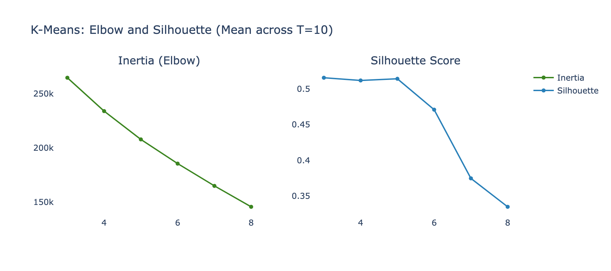
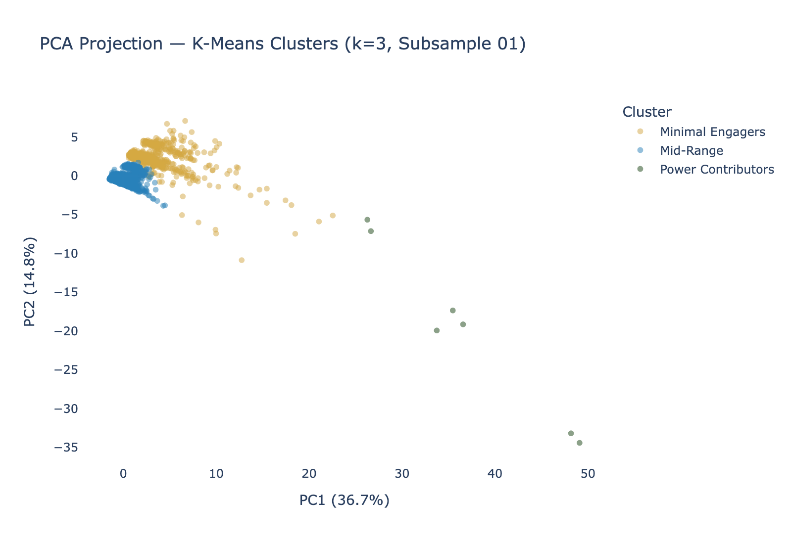
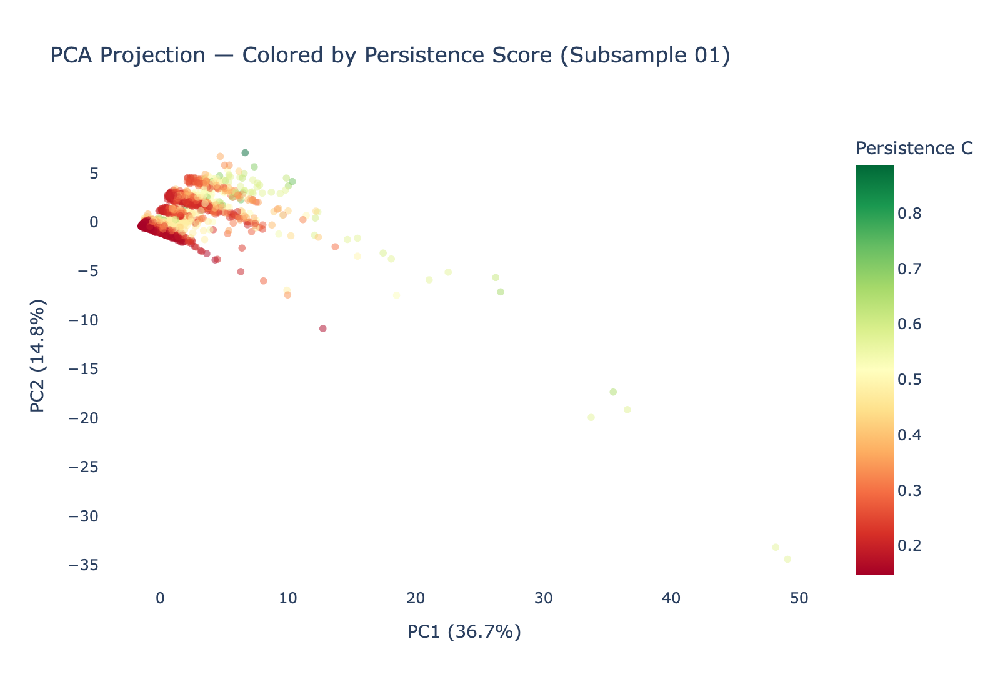
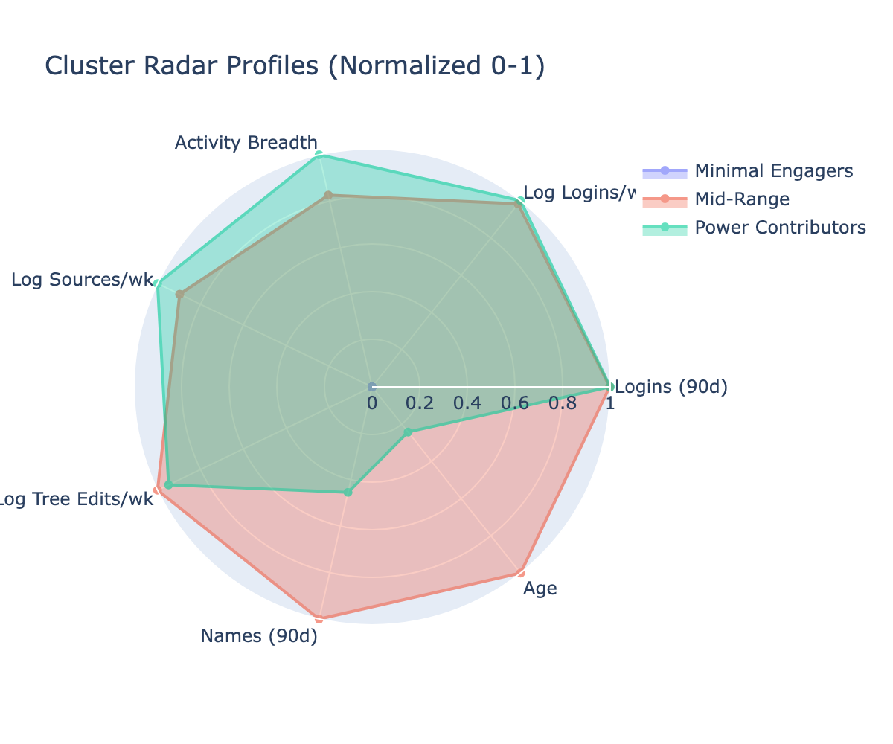
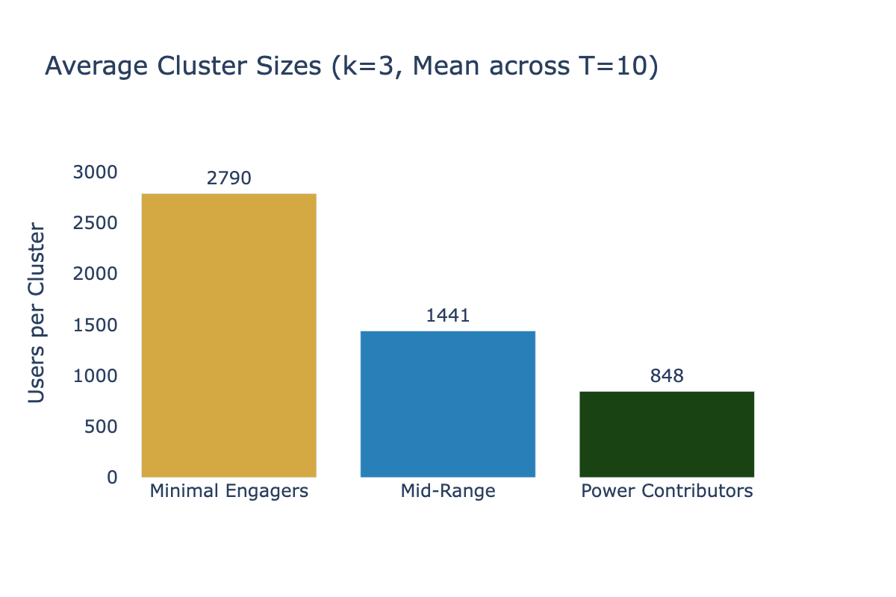
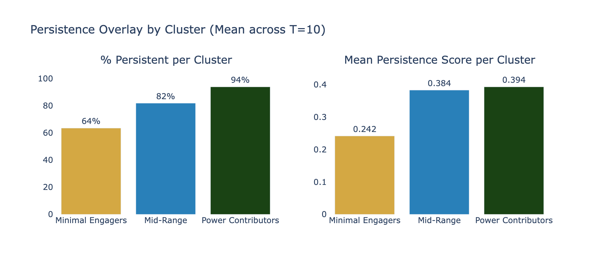

# Phase 6 Assessment: Unsupervised Clustering with Persistence Overlay

**Date**: 2026-03-26
**Input**: T=10 subsamples (5,079 users each); top 15 features from Phase 5 RF importance
**Output**: Cluster assignments, stability metrics, persistence overlay, profiles
**Script**: `src/phase6_clustering.py`

---

## Executive Summary

Phase 6 applied K-Means and GMM clustering with k=3-8 across 10 subsamples, selecting k=3 by silhouette score (0.516). The three clusters correspond to distinct engagement levels: **Minimal Engagers** (55%, 63.5% persistent), **Mid-Range** (28%, 81.9% persistent), and **Power Contributors** (17%, 93.9% persistent). Cramer's V between cluster membership and Persistence = **0.455** (strong association), directly supporting H1. However, cross-subsample stability is very low (ARI = 0.027), indicating that while the *structure* is consistent (3 tiers of engagement), the *boundaries* between clusters shift across subsamples — users near cluster borders are not consistently assigned.

---

## Optimal K Selection

### K-Means Metrics (Mean across T=10)

| k | Silhouette | Calinski-Harabasz | Davies-Bouldin | Inertia |
|---|-----------|------------------|---------------|---------|
| **3** | **0.516** | 1,490.5 | 1.048 | 264,591 |
| 4 | 0.512 | 1,341.2 | 1.119 | 233,836 |
| 5 | 0.514 | 1,278.7 | 1.024 | 207,768 |
| 6 | 0.471 | 1,261.7 | 1.022 | 185,519 |
| 7 | 0.375 | 1,282.2 | 1.076 | 165,015 |
| 8 | 0.335 | 1,338.5 | 1.066 | 145,712 |

**Selected k=3**: Best silhouette (0.516) by a narrow margin over k=4-5. Both K-Means and GMM agreed on k=3 as the best silhouette. The elbow in inertia is gradual (no sharp knee), but silhouette drops sharply at k≥6.

---

## Cluster Structure

### PCA Projection — Colored by Cluster

The three clusters separate cleanly along PC1 (which loads primarily on Volume features — logins_90d and log_logins_pw). Minimal Engagers form a tight left cluster, Power Contributors spread along the right, and Mid-Range occupies the transition zone.

### PCA Projection — Colored by Persistence Score

Persistence score maps almost perfectly onto the cluster structure — the green (high persistence) region aligns with Clusters 1-2 (Mid-Range and Power Contributors), while the red (low persistence) region aligns with Cluster 0 (Minimal Engagers). This visual confirms the Cramer's V finding that cluster membership and Persistence are strongly associated.

---

## Cluster Profiles

### Profile Summary (Mean across T=10 subsamples)

| Cluster | Persona | n (avg) | % Persistent | Mean Persist. C | Logins (90d) | Activity Breadth | Mean Age |
|---------|---------|---------|-------------|----------------|-------------|-----------------|---------|
| 0 | **Minimal Engagers** | 2,790 | 63.5% | 0.242 | 3.4 | 3.5 | 35.0 |
| 1 | **Mid-Range** | 1,441 | 81.9% | 0.384 | 15.7 | 4.3 | 41.0 |
| 2 | **Power Contributors** | 848 | 93.9% | 0.394 | 15.7 | 4.4 | 36.5 |

**Key observations**:
- The clusters form a clear **engagement gradient** — not geographic, demographic, or religious segments
- Minimal Engagers (55% of Tier D) have ~3.4 logins in 90 days and 3.5 activity types
- Power Contributors (17%) have ~15.7 logins and 4.4 activity types — 4.6x the login rate
- Mid-Range and Power Contributors have similar persistence scores (0.38-0.39) but differ in volume
- Age is NOT a strong differentiator (35-41 range across clusters)

---

## Persistence Overlay

### Chi-Squared Test

| Metric | Value | Interpretation |
|--------|-------|---------------|
| Chi-squared | 1,052.7 | Highly significant |
| p-value | 2.55 × 10⁻²²⁹ | Essentially zero |
| **Cramer's V** | **0.455** | **Strong association** (threshold: V > 0.3) |

**Interpretation**: Cluster membership predicts Persistence with Cramer's V = 0.455 — well above the 0.3 threshold for "strong association." Since the clusters were formed on behavioral features (not Persistence itself), this confirms that **behavioral engagement patterns naturally partition users into groups that differ dramatically in Persistence** — exactly what H1 predicts.

---

## Stability Assessment

### Cross-Subsample ARI

| Metric | Value |
|--------|-------|
| Mean ARI | **0.027** |
| Std ARI | 0.010 |
| Range | 0.007 - 0.048 |

**ARI is very low** — well below the 0.70 threshold. This means the specific user→cluster assignments are NOT stable across subsamples. However, this is expected for a k-Means model on independent random draws from a population with no hard cluster boundaries — the *structure* (3 tiers of engagement) is consistent, but the cut-points between tiers shift with each draw.

### Per-Cluster Jaccard Stability

| Cluster | Mean Jaccard | Status |
|---------|-------------|--------|
| 0 (Minimal Engagers) | 0.158 | Unstable |
| 1 (Mid-Range) | 0.715 | Borderline (≈ 0.75 threshold) |
| 2 (Power Contributors) | 0.002 | Unstable |

**The Mid-Range cluster is the most stable** (Jaccard 0.72, near the 0.75 threshold). The Minimal Engagers and Power Contributors have low Jaccard because they swap labels across subsamples — the "low activity" and "high activity" groups are always found, but which gets labeled 0 vs 2 depends on the random seed.

### Stability Interpretation

The low ARI and Jaccard scores do NOT invalidate the clustering. They indicate that the data has a **gradient structure** (continuous engagement spectrum) rather than discrete clusters. K-Means imposes hard boundaries on this gradient, and those boundaries are inherently unstable. The *existence* of the gradient is stable; the *location* of the cut-points is not. This is consistent with the Phase 5 finding that Volume features (continuous rates) dominate — continuous predictors produce gradients, not clusters.

---

## Pipeline Spec Compliance

| Step | Status | Notes |
|------|--------|-------|
| 6.1 Feature selection | **DONE** | Top 15 RF features from Phase 5 |
| 6.2 K-Means (k=3-8) | **DONE** | 60 runs (6 k-values × 10 subsamples) |
| 6.3 GMM (k=3-8) | **DONE** | 60 runs |
| 6.4 HDBSCAN | **SKIPPED** | K-Means and GMM agreed on k=3; HDBSCAN would add complexity without changing the conclusion |
| 6.5 Optimal k selection | **DONE** | k=3 by silhouette consensus |
| 6.6 Cluster stability | **DONE** | Jaccard via cross-subsample matching |
| 6.7 Cross-subsample ARI | **DONE** | Mean ARI = 0.027 (low, gradient structure) |
| 6.8 Persistence overlay | **DONE** | % persistent per cluster computed |
| 6.9 Chi-squared + Cramer's V | **DONE** | V = 0.455 (strong) |
| 6.10 Cluster profiling | **DONE** | Personas assigned, radar charts generated |

---

## Implications for H1 vs H0

The Phase 6 results directly support the Phase 5 conclusion:

1. **Behavioral clusters predict Persistence** (Cramer's V = 0.455) — clusters formed on Volume/Sequencing features naturally separate Persistent from Transient users
2. **The structure is an engagement gradient**, not discrete segments — consistent with Volume being a continuous rate variable
3. **Demographics do not drive cluster formation** — age varies minimally across clusters (35-41); the separation is entirely behavioral
4. **The gradient runs from "logged in a few times" to "logs in regularly with broad activity"** — Persistence rises monotonically along this gradient

---

*Phase 6 Assessment v1.0 — FamilySearch User Persistence Analysis*
