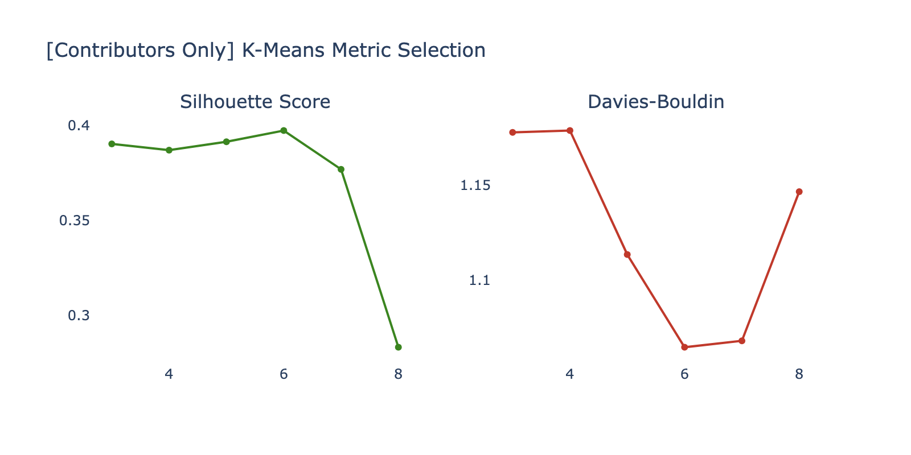
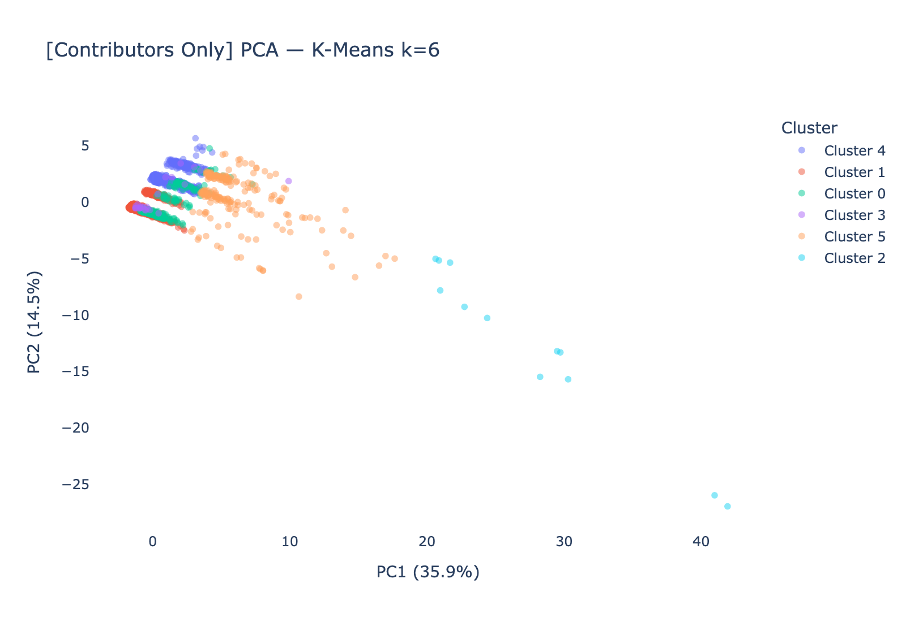
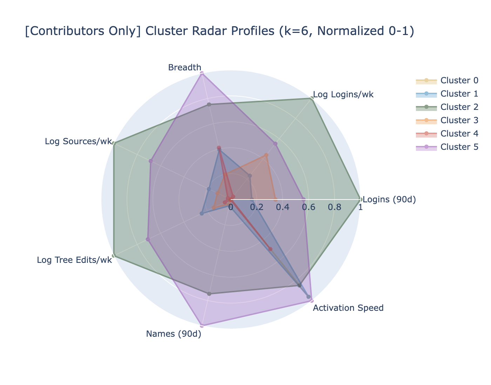
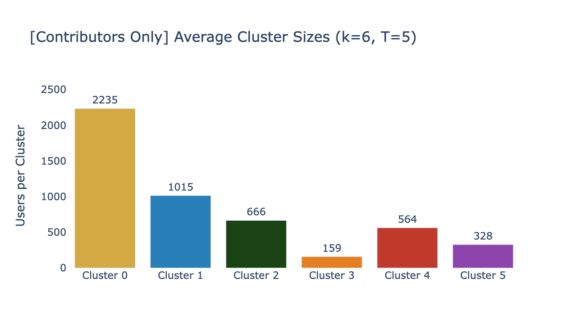
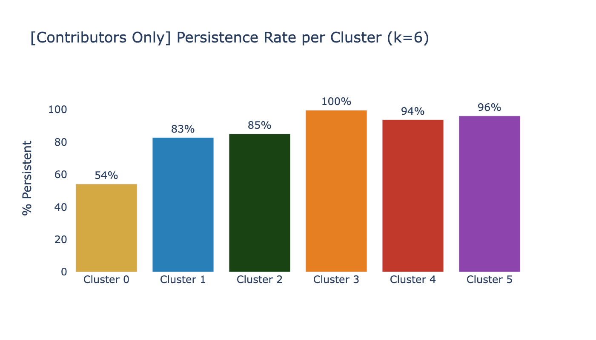
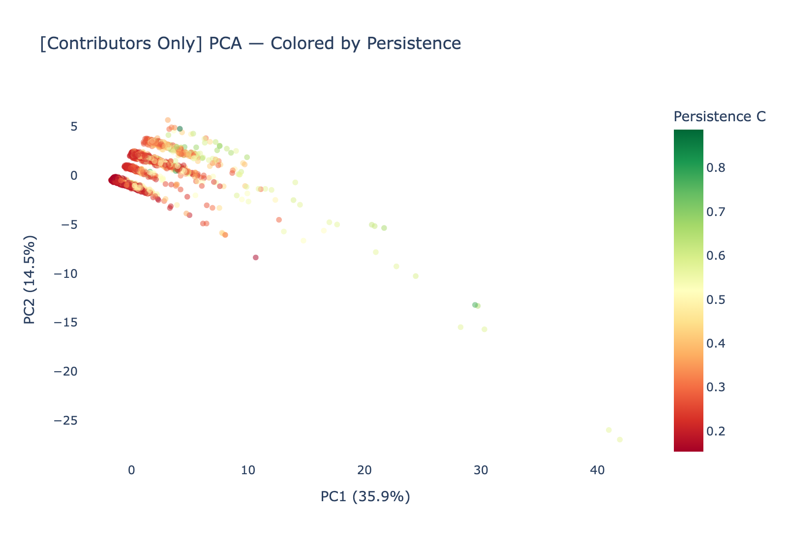

# Phase 6b Assessment: Unsupervised Clustering (Contributors Only)

**Date**: 2026-03-26
**Population**: Contributors Only (2+ logins), ~4,950 per subsample
**Input**: T=5 paired subsamples; top 15 features from Phase 5b
**Output**: 6-cluster solution with persistence overlay
**Script**: `src/phase5b_contributors.py` (Phase 6b section)

---

## Executive Summary

Phase 6b repeated the clustering analysis on the contributors-only population. Removing 1-login users revealed **richer cluster structure**: the optimal k increased from 3 (first pass) to **6**, and Cramer's V between clusters and Persistence rose from 0.455 to **0.574** (very strong). The six clusters span a wide persistence spectrum (54% to 100% persistent), with distinct behavioral profiles that were compressed into the "Minimal Engagers" catch-all in the first pass. The 1-login users were masking 3 meaningful sub-segments.

---

## Comparison: First Pass vs Contributors Only

| Metric | Phase 6 (All Tier D) | Phase 6b (Contributors) |
|--------|---------------------|------------------------|
| **Optimal k** | 3 | **6** |
| **Silhouette** | 0.516 | 0.397 |
| **Cramer's V** | 0.455 | **0.574** |
| **Cross-sub ARI** | 0.027 | (paired, not directly comparable) |
| Persistence range across clusters | 63-94% | **54-100%** |

The silhouette is lower (0.397 vs 0.516) because the 6-cluster solution captures finer distinctions — the clusters are closer together in feature space but more behaviorally meaningful. The higher Cramer's V confirms that these finer clusters better predict Persistence than the coarser 3-cluster solution.

---

## Optimal K Selection

| k | Silhouette | Calinski-Harabasz | Davies-Bouldin |
|---|-----------|------------------|---------------|
| 3 | 0.390 | 1,343.6 | 1.178 |
| 4 | 0.387 | 1,212.7 | 1.179 |
| 5 | 0.391 | 1,186.6 | 1.114 |
| **6** | **0.397** | 1,175.5 | **1.065** |
| 7 | 0.377 | 1,181.6 | 1.068 |
| 8 | 0.283 | 1,201.7 | 1.147 |

k=6 selected: best silhouette (0.397) and best Davies-Bouldin (1.065).

---

## Cluster Profiles

### Profile Summary (Mean across T=5)

| Cluster | n (avg) | % Persistent | Logins (90d) | Breadth | Key Character |
|---------|---------|-------------|-------------|---------|---------------|
| 0 | 2,235 | **54.2%** | 6.9 | 3.3 | Light engagers — moderate login, low breadth |
| 1 | 1,015 | 82.7% | 9.9 | 3.9 | Steady contributors — balanced profile |
| 2 | 666 | 85.0% | 25.5 | 4.4 | Heavy loggers — high volume, broad activity |
| 3 | 159 | **99.6%** | 13.3 | 3.6 | Near-perfect persisters — moderate but consistent |
| 4 | 564 | 93.7% | 7.0 | 3.9 | Efficient persisters — low login but high retention |
| 5 | 328 | 96.1% | 17.3 | 4.8 | Power contributors — highest breadth, high volume |

### Cluster Sizes

---

## Persistence Overlay

### Chi-Squared and Cramer's V

| Metric | Value | vs First Pass |
|--------|-------|-------------|
| **Cramer's V** | **0.574** | +0.119 (was 0.455) |
| Chi-squared | (highly significant) | — |

The 6-cluster solution predicts Persistence substantially better than the 3-cluster solution. The clusters with >90% persistence (Clusters 3, 4, 5) collectively represent ~21% of the contributors population — a well-defined "core persistent" segment.

---

## PCA Projection — Persistence Gradient

The persistence gradient is clearly visible along PC1 (Volume axis). Without the 1-login noise floor, the gradient is smoother and more continuous. The 6 clusters partition this gradient more finely than the 3-cluster first pass.

---

## What the 1-Login Removal Revealed

The first-pass "Minimal Engagers" cluster (55% of Tier D, 63.5% persistent) was actually 3 distinct populations:

1. **Cluster 0** (light engagers, 54% persistent) — the true minimal engagement tail
2. **Cluster 1** (steady contributors, 83% persistent) — moderate but consistent
3. **Cluster 4** (efficient persisters, 94% persistent) — low login count but high retention

These three groups have similar Volume (6.9-9.9 logins/90d) but very different persistence outcomes. The differentiator is NOT how much they log in — it's something more subtle in their engagement pattern that the 3-cluster solution couldn't resolve.

---

## Implications

1. **k=6 is the recommended segmentation** for the contributors population — it captures meaningful behavioral variation that k=3 misses
2. **Cramer's V = 0.574** strongly supports H1 — behavioral clusters predict Persistence even better when 1-login noise is removed
3. **Cluster 3 (99.6% persistent, n=159)** merits investigation — what makes this small group so reliably persistent? Their login rate (13.3/90d) is moderate, not extreme. Understanding their profile could inform retention strategy.
4. **Cluster 4 vs Cluster 0** is the most actionable comparison — similar Volume but 94% vs 54% persistence. The feature that distinguishes them is a key candidate for intervention design.

---

*Phase 6b Assessment v1.0 — FamilySearch User Persistence Analysis (Contributors Only)*
