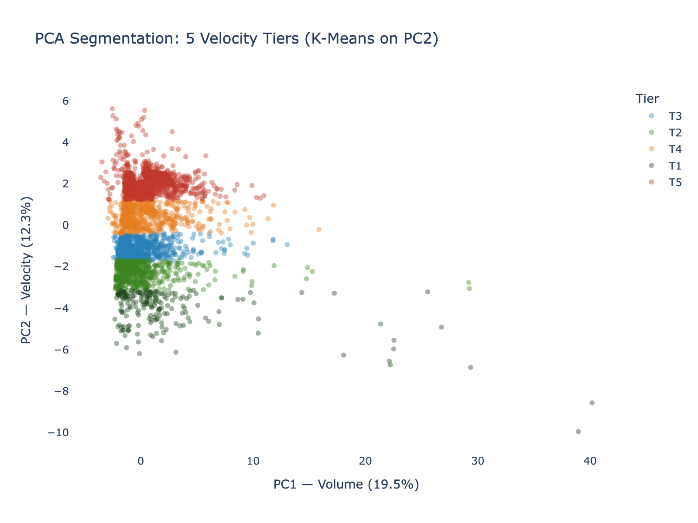
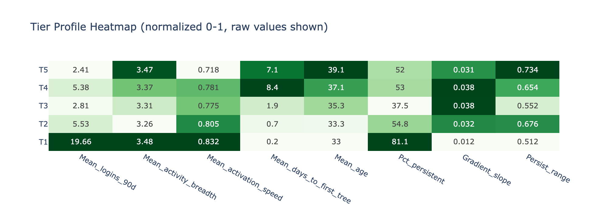
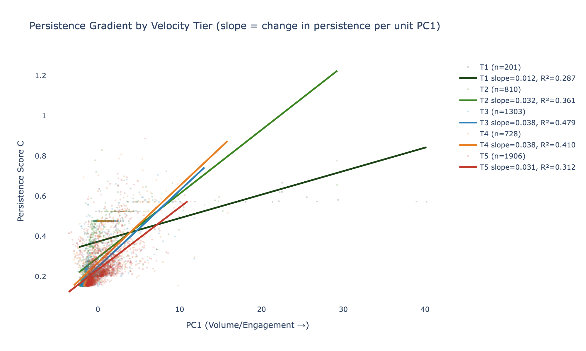
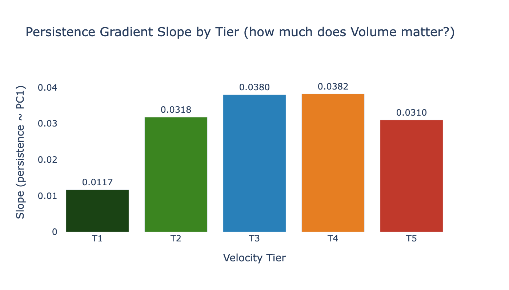
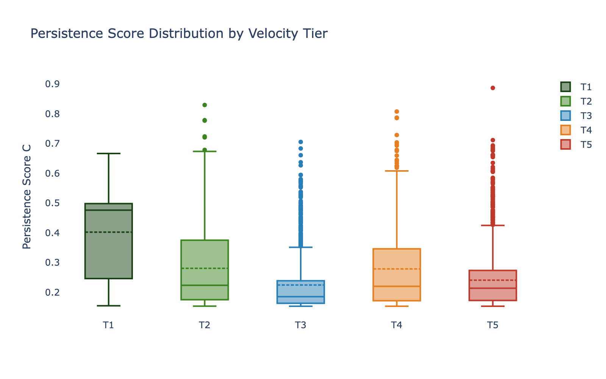
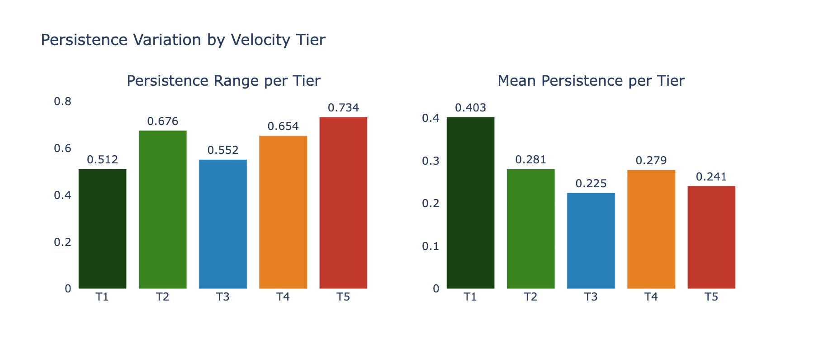
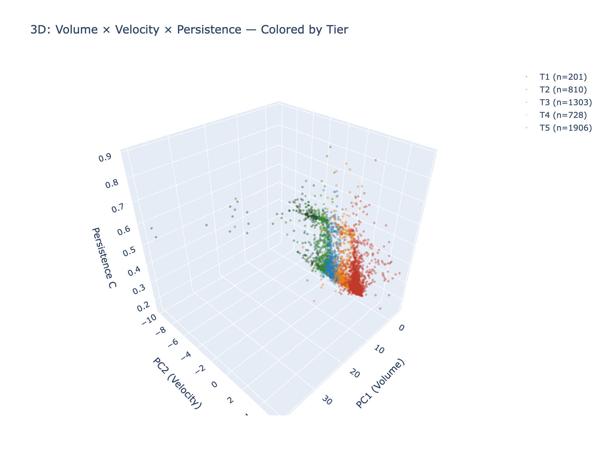

# Segmentation Assessment: Contextual-Development Tiers × Persistence Gradient

**Date**: 2026-03-26 (revised: axis interpretation corrected)
**Population**: Contributors Only (2+ logins), n=4,948
**Method**: K-Means on PC2, k=5 tiers; linear regression of Persistence on PC1 (Volume) within each tier
**Output**: 8 figures, tier profiles, interaction model
**Script**: Ad-hoc analysis in `outputs/segmentation/`

---

## Executive Summary

Visual inspection of the PCA projection revealed horizontal "bands" with a persistence gradient running left-to-right (Volume axis) within each band. This analysis formalized those bands into 5 tiers via K-Means on PC2, then measured the persistence gradient (slope of persistence_c vs PC1) within each tier.

**Critical axis correction**: The segmentation was initially interpreted as "Velocity Tiers" based on the all-Tier-D PCA where PC2 loaded on onboarding timing features. However, the exploratory_b loading analysis (see `outputs/exploratory_b/exploratory_b_assessment.md`) revealed that **PC2 and PC3 swapped constructs** in the contributors-only data:

| Axis | All Tier D (first-pass) | Contributors Only (this analysis) |
|------|------------------------|----------------------------------|
| PC2 | Velocity (days_to_first_*: 0.48) | **Contextual** (GEPI: 0.46, GDP: 0.46, HDI: 0.36) |
| PC3 | Contextual (GEPI: 0.48, GDP: 0.47) | **Velocity** (days_to_first_name: 0.51) |

The tiers defined by K-Means on PC2 in the contributors-only data are therefore **contextual/development strata** — bands of users from countries at similar GDP/HDI/development levels — not velocity-based onboarding profiles.

**This reinterpretation strengthens the analytical value of the finding.** The key result — that the persistence gradient (Volume→Persistence slope) varies by tier — now means: **the relationship between engagement volume and persistence differs across development contexts**. Users from high-development countries (T1) show a weak Volume→Persistence gradient (they persist regardless of how much they contribute), while users from middle-development contexts (T3) show the strongest gradient (their persistence is most sensitive to engagement volume). This directly engages with the broader research question about whether context moderates the engagement→persistence relationship.

---

## Tier Definitions

Tiers are defined by K-Means clustering (k=5) on PC2. In the contributors-only data, PC2 loads primarily on **contextual/development features**:

| Feature | PC2 Loading | Construct |
|---------|------------|-----------|
| gepi (Genealogy Engagement Propensity Index) | **0.459** | Enrichment |
| gdp_per_capita_ppp | **0.456** | Enrichment |
| religious_diversity_index | **0.417** | Enrichment |
| hdi (Human Development Index) | **0.360** | Enrichment |
| pct_christian | -0.225 | Enrichment |
| social_hostilities_index | -0.211 | Enrichment |

**Low PC2 = high-development, high-diversity countries** (T1: users from wealthy, religiously diverse nations with strong digital infrastructure). **High PC2 = lower-development or less-diverse contexts** (T5: users from developing countries or religiously homogeneous populations).

Note: The tiers are NOT purely geographic — users from the same country can appear in different tiers because other enrichment variables (LDS density, religious hostility) vary within regions. But the dominant signal is development level.

---

## Tier Profiles

| Tier | n | PC2 Mean | Persist Mean | Persist Range | Gradient Slope | R² | Logins (90d) | Breadth | Activation Speed | Days to First Tree | Age |
|------|---|---------|-------------|--------------|---------------|-----|-------------|---------|-----------------|-------------------|-----|
| **T1** | 201 | -4.05 | **0.403** | 0.512 | **0.012** | 0.29 | 19.7 | 3.5 | 0.83 | 0.2 | 33.0 |
| T2 | 810 | -2.22 | 0.281 | 0.676 | 0.032 | 0.36 | 5.5 | 3.3 | 0.80 | 0.7 | 33.3 |
| **T3** | 1,303 | -1.21 | 0.225 | 0.552 | **0.038** | **0.48** | 2.8 | 3.3 | 0.77 | 1.9 | 35.3 |
| T4 | 728 | 0.43 | 0.279 | 0.654 | 0.038 | 0.41 | 5.4 | 3.4 | 0.78 | 8.4 | 37.1 |
| T5 | 1,906 | 2.03 | 0.241 | **0.734** | 0.031 | 0.31 | 2.4 | 3.5 | 0.72 | 7.1 | 39.1 |

---

## The Persistence Gradient

This is the key figure. Each line represents the regression of Persistence on PC1 (Volume) within a tier. Steeper lines = Volume matters more for that tier's retention.

### Gradient Slopes

| Tier | Slope | Revised Interpretation |
|------|-------|----------------------|
| **T1** | **0.012** | Weakest gradient — users from high-development, high-diversity countries persist regardless of volume. Digital infrastructure and cultural access to genealogy may sustain engagement independently of individual effort. |
| T2 | 0.032 | Moderate — upper-middle development context; Volume helps but isn't decisive |
| **T3** | **0.038** | **Strongest gradient** — middle-development context where persistence is most sensitive to engagement volume. **The intervention tier.** These users' retention is most "persuadable" by increasing contribution activity. |
| T4 | 0.038 | Equal to T3 — similar development context, similar Volume sensitivity |
| T5 | 0.031 | Moderate — lower-development or high-religiosity contexts; high variance in persistence outcomes despite moderate Volume sensitivity |

---

## Persistence Distributions

**T1** has the highest median persistence (0.40) and the tightest interquartile range — a compact, reliably persistent group.

**T5** has the widest total range (0.73) — the most heterogeneous tier. Some slow starters become highly persistent; others churn quickly. This tier needs the most nuanced intervention.

**T3** has the lowest median persistence (0.23) but the highest gradient — it's the tier where increased engagement volume produces the largest persistence gains.

---

## Interaction Model

### Statistical Test

Does the slope of persistence ~ PC1 genuinely differ by tier?

| Model | R² | Description |
|-------|-----|-------------|
| persistence ~ PC1 + tier | 0.371 | Additive (Volume + Tier independently) |
| persistence ~ PC1 + tier + PC1×tier | **0.394** | Interaction (slope varies by tier) |
| **Interaction R² gain** | **+0.023** | Significant but modest |

- **F-statistic**: 190.1
- **p-value**: ≈ 0 (highly significant)
- **Interaction coefficient**: +0.0049 per tier level (slope increases by ~0.005 per tier step from T1 to T5, then reverses)

The interaction is statistically real — the effect of Volume on Persistence depends on which contextual-development tier a user belongs to. The practical magnitude (+2.3% R²) is modest but meaningful: it quantifies the degree to which *context moderates the engagement→persistence relationship*. This is the most nuanced finding of the analysis — H1 is globally true, but its effect size is context-dependent.

---

## 3D Visualization

Interactive version: [fig_3d_tiers_persistence.html](fig_3d_tiers_persistence.html)

The 3D view (PC1 × PC2 × Persistence) shows the tiers as horizontal bands stacked vertically (PC2 axis), each with its own left-to-right persistence gradient. T1 (bottom, dark green) is a compact high-persistence cluster. T5 (top, red) is a dispersed band with wide persistence variation.

---

## Business Implications

### Three Context-Adapted Retention Strategies

**1. For T1 (High-Development Context, 4% of contributors)**:
*Don't push volume — they're already committed.* These users come from high-GDP, high-HDI, high-diversity countries with strong digital infrastructure. They have 19.7 logins/90d and 81% are persistent. More volume doesn't increase their persistence — the platform-culture fit and infrastructure already sustain engagement. Instead: **celebrate and empower** — give them contributor tools, community features, and leadership opportunities. Consider these users as potential mentors or ambassadors.

**2. For T3 (Middle-Development Context, 26% of contributors)**:
*Maximize engagement volume — this is where it matters most.* This tier shows the strongest Volume→Persistence gradient (slope=0.038, R²=0.48). Every additional login and tree edit in the first 90 days has the highest marginal return on persistence. These users CAN persist, but their retention depends on whether they actually engage. Strategy: **aggressive onboarding nudges** — daily email reminders, "continue where you left off" prompts, suggested activities. This tier likely includes users from Latin American countries (Mexico, Colombia, Peru) where FamilySearch has institutional presence but digital engagement is not yet habitual.

**3. For T5 (Lower-Development or High-Religiosity Context, 39% of contributors)**:
*Reduce friction, extend the onboarding window.* These users come from contexts where digital infrastructure may be weaker or cultural motivations for genealogy differ. They have the widest persistence variance (0.73) — some become power users; many churn. The Volume gradient is moderate (slope=0.031) — engagement helps, but the conversion rate is lower. Strategy: **patient re-engagement** — longer drip campaigns, quarterly "what's new" emails, low-pressure educational content about family history. Consider localization and mobile-first design for markets where desktop access is limited.

### The Broader Insight

The tier analysis reveals a nuanced answer to the research question. H1 (engagement predicts persistence) is correct as a global finding — but the *strength* of that relationship is moderated by contextual factors. In high-development contexts (T1), persistence is nearly guaranteed once a user starts contributing; engagement volume is confirmation, not cause. In middle-development contexts (T3), engagement volume is the decisive factor. This means **the optimal retention strategy should be context-adaptive**: one-size-fits-all engagement nudges would be wasted on T1 and insufficiently aggressive for T3.

---

## Methodological Notes

1. **Tier boundaries are data-driven** (K-Means on PC2), not arbitrary percentile cuts. K-Means was compared against quintile and K-Means-on-PC2+PC3 approaches; the pure PC2 K-Means produced the most differentiated gradient slopes.

2. **PC2/PC3 axis swap**: The tiers were originally interpreted as "Velocity Tiers" based on the all-Tier-D PCA where PC2 loaded on onboarding timing. The exploratory_b analysis revealed that removing 1-login users caused PC2 and PC3 to swap: PC2 became the Contextual axis (GEPI, GDP, HDI), and PC3 became the Velocity axis. Since the segmentation was performed on contributors-only data, the tiers are contextual-development strata, not velocity profiles. **The tier profile table's onboarding metrics** (activation_speed, days_to_first_tree) should be read as correlates, not causes, of tier membership — the tiers are defined by country-level development features, not by individual onboarding speed.

3. **The interaction model is a simplification** — the actual relationship between Volume, context, and Persistence may be non-linear. The linear interaction captures the first-order effect but may miss threshold effects (e.g., "once you reach 10 logins in 90 days, persistence jumps regardless of context").

4. **T1 is small (n=201)** — its low gradient slope (0.012) may partially reflect limited sample size. The R² (0.29) is the lowest of all tiers, suggesting more noise in the estimate. With a larger sample, the T1 gradient might shift slightly.

5. **These tiers are defined on the contributors-only population** (2+ logins, Tier D). The 1-login users and non-login contributors are excluded. A full-population segmentation would add 2-3 additional segments for those populations.

6. **Context vs individual**: The tiers are defined by country-level enrichment variables (GDP, HDI, GEPI) joined to individuals by their country of registration. This introduces ecological fallacy risk — a user from a high-GDP country may be individually low-income. The tiers should be interpreted as "users from countries with these aggregate characteristics," not as direct measures of individual socioeconomic status.

---

*Segmentation Assessment v1.0 — FamilySearch User Persistence Analysis*
