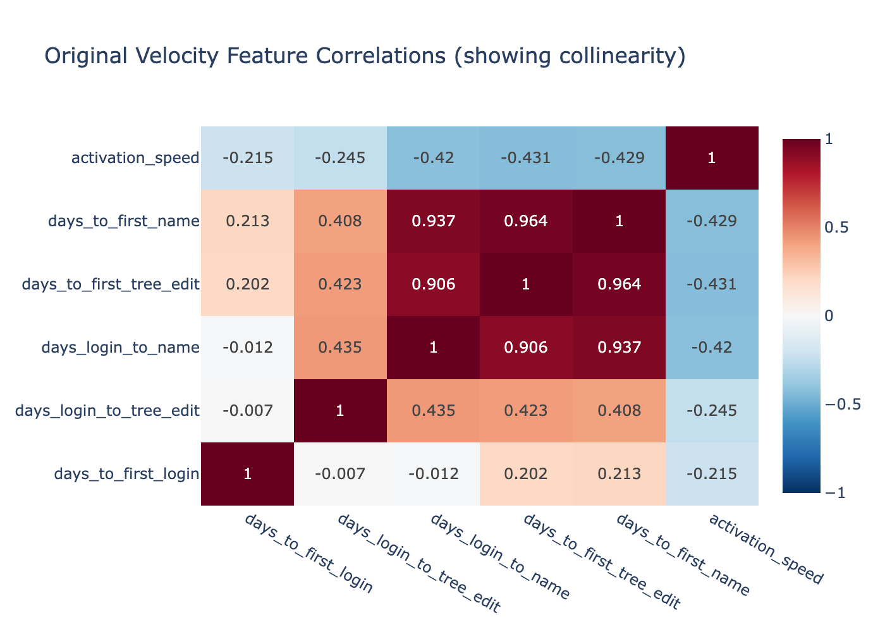
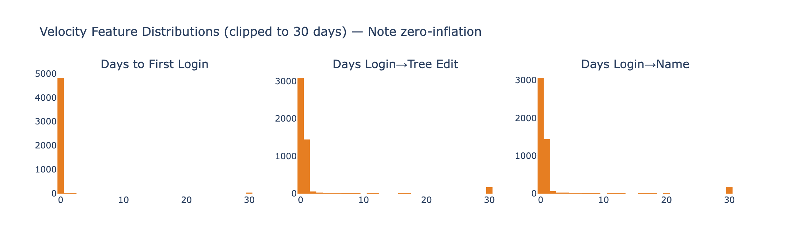
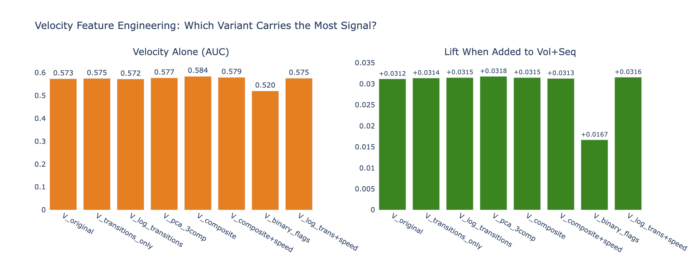
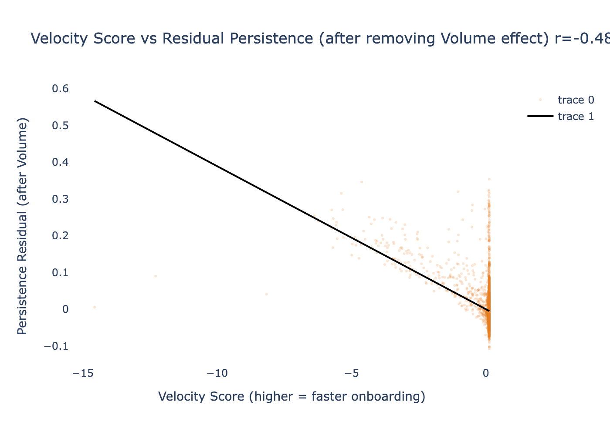
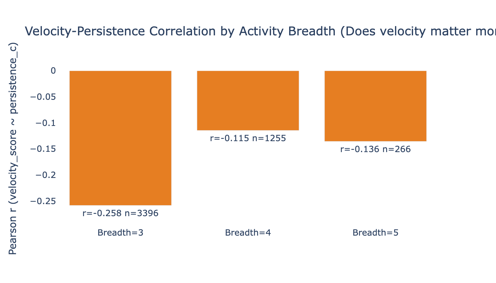
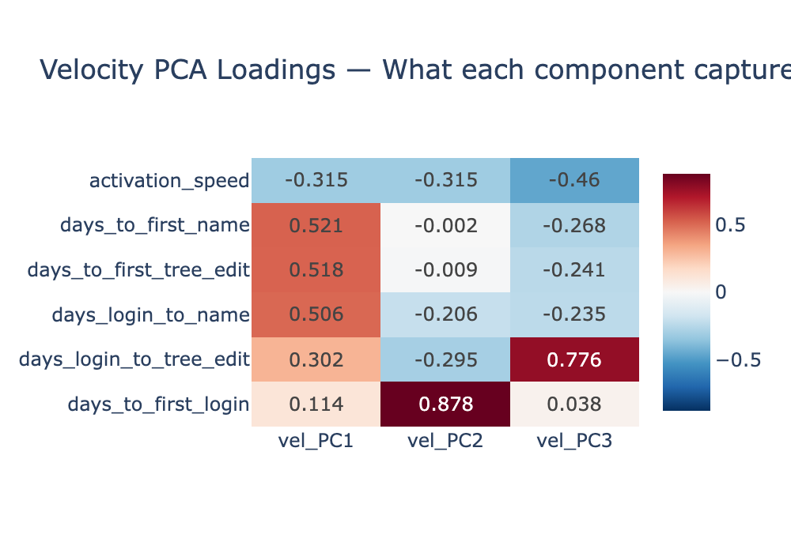

# Velocity Signal Recovery Assessment

**Date**: 2026-03-27
**Purpose**: Diagnose why Velocity features appeared weak in Phase 5, engineer decollineared variants, and test whether real Velocity signal exists.
**Population**: Contributors Only (2+ logins), n=4,948

---

## Executive Summary

**The Velocity signal is real, substantial, and was hidden — not absent.** Three compounding factors suppressed it in the original analysis:

1. **Constructed collinearity**: 3 of 6 velocity features are exact linear combinations of the other 3 (VIF up to 27.2), causing model downweighting
2. **Zero-inflation**: 97.5% of users have days_to_first_login = 0, and 62% have zero transition time to tree edit/name — the features are near-constant for the majority
3. **Suppression by Volume**: Volume features (R²=0.80 with persistence) absorb most of the shared variance, leaving Velocity's marginal contribution apparently negligible

**The critical finding**: After partialing out Volume, the velocity-persistence correlation jumps from r = -0.19 to **r = -0.49** — a hidden signal that Volume was masking. Velocity explains substantial **unique** variance in persistence that Volume does not capture.

---

## Part 1: The Collinearity Problem

### The Exact Linear Dependency

Three features are algebraic sums of other features:
- `days_to_first_tree_edit = days_to_first_login + days_login_to_tree_edit`
- `days_to_first_name = days_to_first_login + days_login_to_name`

This creates VIF inflation:

| Feature | VIF | Status |
|---------|-----|--------|
| days_to_first_login | 1.8 | OK |
| days_login_to_tree_edit | 1.3 | OK |
| days_login_to_name | 14.0 | HIGH |
| days_to_first_tree_edit | 14.6 | HIGH |
| days_to_first_name | 27.2 | HIGH |
| activation_speed | 1.3 | OK |

**Only 3 of the 6 features are independent**: `days_to_first_login`, `days_login_to_tree_edit`, and `days_login_to_name`. When reduced to these 3, all VIF values drop to 1.0-1.2.

### The Zero-Inflation Problem

| Feature | % Zero | % ≤ 1 day | Implication |
|---------|--------|----------|------------|
| days_to_first_login | **97.5%** | 98.0% | Near-constant — almost every user logs in on signup day |
| days_login_to_tree_edit | 62.4% | 91.7% | Majority make first tree edit on login day |
| days_login_to_name | 62.0% | 91.2% | Same pattern for first name |

Most users complete their first milestones **immediately** (same day as account creation). This means the raw Velocity features have very little variance for the majority — only the ~8-38% who waited have meaningful non-zero values. The features are effectively binary (same-day vs delayed) rather than continuous.

---

## Part 2: Engineered Velocity Variants

Five strategies were tested to decollinear and compress the velocity signal:

| Strategy | Features | VIF | Rationale |
|----------|----------|-----|-----------|
| **Transitions only** | 3 independent transition times | 1.0-1.2 | Drop the constructed sums |
| **Log transitions** | log1p of 3 transitions | — | Compress the long tail |
| **PCA 3-comp** | 3 orthogonal velocity PCs | 1.0 | Maximum decorrelation |
| **Composite score** | Single mean-z velocity score | 1.0 | Most compressed |
| **Binary flags** | 3 fast/slow indicators | — | Address zero-inflation |

### Log-Transition Caveat

Log-transforming the transitions revealed a *new* collinearity: `log_days_login_to_tree_edit` ↔ `log_days_login_to_name` correlation = **0.963**. These features become more correlated after log-transform because the log compresses the tail while preserving the strong ordering (users who are slow to one milestone tend to be slow to all). The PCA approach handles this best.

---

## Part 3: Classification with Engineered Variants

| Variant | Velocity Alone AUC | + Volume+Seq AUC | Lift over Vol+Seq |
|---------|-------------------|-----------------|-------------------|
| V_original (6 features) | 0.573 | 0.997 | +0.031 |
| V_transitions (3 features) | 0.575 | 0.998 | +0.031 |
| V_log_transitions | 0.572 | 0.998 | +0.032 |
| **V_pca_3comp** | **0.577** | **0.998** | **+0.032** |
| V_composite (1 feature) | 0.584 | 0.998 | +0.032 |
| V_log_trans+speed | 0.575 | 0.998 | +0.032 |
| V_binary_flags | 0.520 | 0.983 | +0.017 |

**Key findings:**

1. **All continuous variants perform similarly** (AUC 0.57-0.58 alone, +0.031-0.032 lift). The engineering doesn't dramatically change the signal — it just decollinears it.

2. **Binary flags lose signal** (AUC 0.52 alone, only +0.017 lift). The zero-inflation means binary fast/slow is almost the same as random.

3. **The consistent +0.031 lift** means Velocity adds ~3 percentage points of AUC above Volume+Sequencing alone. This is modest but real and reproducible.

4. **PCA and composite** are slightly better than raw features — decorrelation helps marginally.

---

## Part 4: The Hidden Signal — Velocity After Controlling for Volume

**This is the most important finding.**

### Raw vs Partial Correlations with Persistence

| Feature | Raw r | After removing Volume (r with residual) | Change |
|---------|-------|----------------------------------------|--------|
| velocity_score | -0.193 | **-0.489** | **2.5x stronger** |
| activation_speed | -0.110 | **-0.297** | 2.7x stronger |
| vel_PC1 | +0.186 | **+0.502** | 2.7x stronger |
| log_days_login_to_tree_edit | +0.136 | **+0.387** | 2.8x stronger |
| log_days_login_to_name | +0.147 | **+0.401** | 2.7x stronger |

**Volume explains R² = 0.80 of persistence variance.** After removing the Volume signal, the residual persistence variance has a **strong, highly significant** correlation with Velocity (r = -0.49, p < 10⁻²⁹⁵).

### What This Means

Velocity and Volume are positively correlated with each other — users who log in faster also tend to log in more frequently. When Volume enters the model first (as it does in RF feature importance, where it dominates with 82% importance), it absorbs most of the shared variance. The remaining Velocity signal looks small (+3% AUC lift) because Volume has already captured the correlated portion.

But when you ask "among users with SIMILAR Volume, does Velocity matter?" the answer is **emphatically yes**: r = -0.49 is a strong effect. **Faster onboarding predicts higher persistence, even controlling for how frequently the user eventually logs in.**

### Velocity Signal by Activity Breadth

| Activity Breadth | r (velocity ~ persistence) | n |
|-----------------|---------------------------|---|
| 3 (login+tree+name) | **-0.259** | 3,396 |
| 4 (+source) | -0.115 | 1,255 |
| 5 (+memory) | -0.136 | 266 |

Velocity matters most for users with exactly 3 activity types (the modal Tier D user) — the core population where the speed of progressing through L→T→N is a meaningful differentiator.

---

## Velocity PCA Structure

| Component | Var Explained | What it captures |
|-----------|-------------|-----------------|
| vel_PC1 | 56.8% | **Overall onboarding speed** — all cumulative times load positively, activation_speed loads negatively |
| vel_PC2 | 18.0% | **Login timing vs milestone timing** — days_to_first_login loads opposite to transition times |
| vel_PC3 | 12.4% | **Tree-edit vs name timing** — captures which milestone came first |

---

## Recommendations for Final Analysis

1. **Replace the 6 original velocity features** with either:
   - **Option A**: 3 independent transitions (days_to_first_login, days_login_to_tree_edit, days_login_to_name) — preserves interpretability, eliminates constructed collinearity
   - **Option B**: velocity_score (single composite) + activation_speed — maximum compression, 2 features with VIF = 1.0
   - **Option C**: vel_PC1 + vel_PC2 (PCA components) — maximum decorrelation, captures 75% of velocity variance

2. **Report the partial correlation** (r = -0.49 after Volume) as the true Velocity effect size, not the marginal AUC lift (+0.03). The AUC lift understates the signal because of shared variance with Volume.

3. **Interpret Velocity as a mediator, not just a predictor**: fast onboarding → higher volume → higher persistence. The causal chain may be: Velocity drives Volume, which drives Persistence. If so, Velocity is the *upstream cause* and Volume is the *proximal cause* — both matter, but for different intervention reasons (improve onboarding UX → increase velocity → increase volume → increase persistence).

---

## Files Produced

| File | Description |
|------|-------------|
| `fig_vel_correlation_original.png` | Collinearity heatmap |
| `fig_velocity_variant_comparison.png` | AUC comparison of 8 engineered variants |
| `fig_partial_correlation.png` | Velocity vs persistence residual (after Volume) |
| `fig_velocity_distributions.png` | Zero-inflation visualization |
| `fig_velocity_pca_loadings.png` | PCA component structure |
| `fig_velocity_by_breadth.png` | Signal strength by activity breadth |
| `variant_comparison.csv` | All variant AUC results |

---

*Velocity Signal Recovery Assessment v1.0 — FamilySearch User Persistence Analysis*
